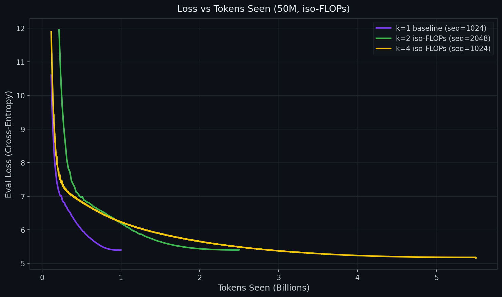
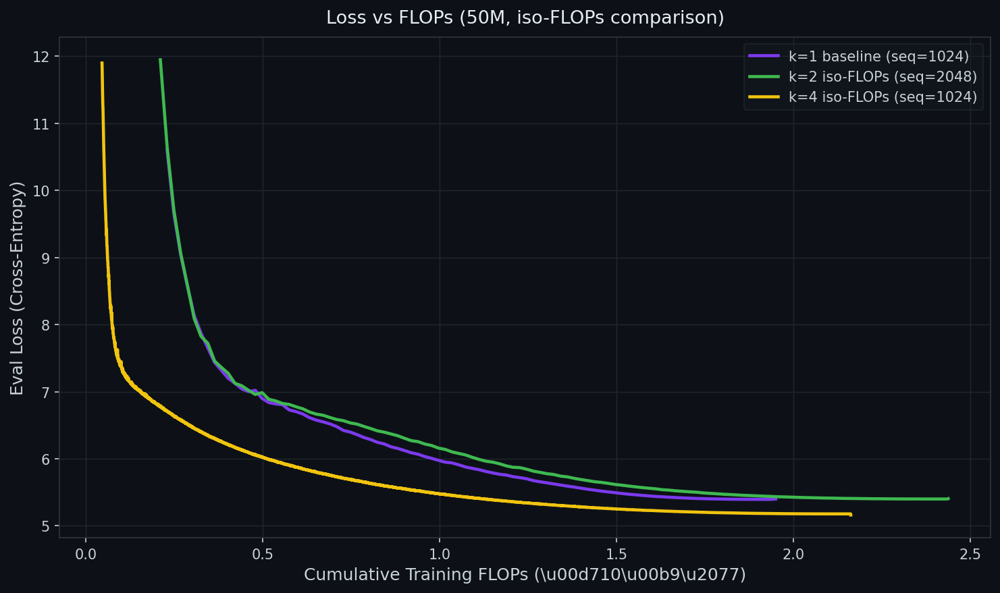
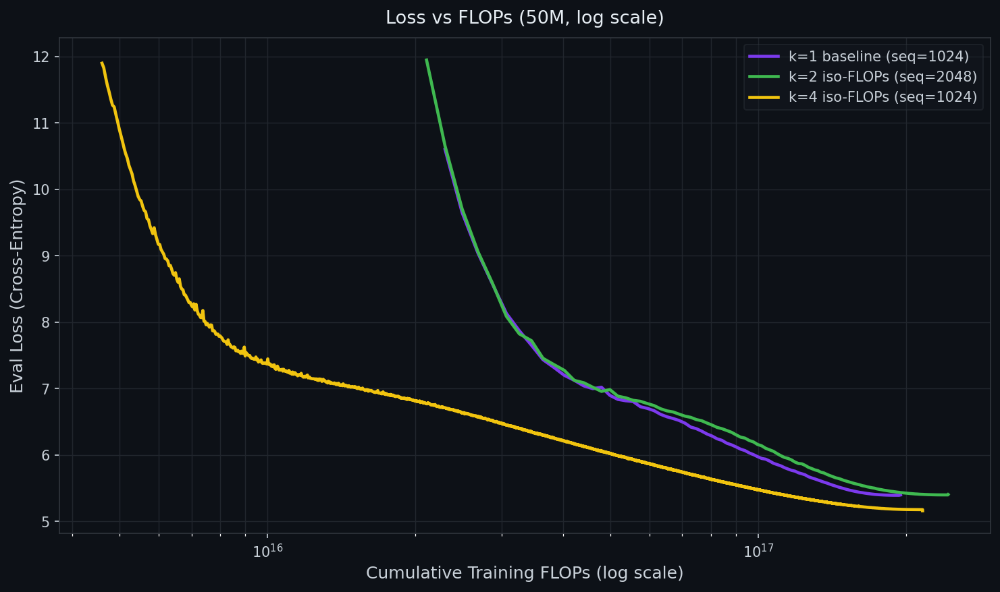
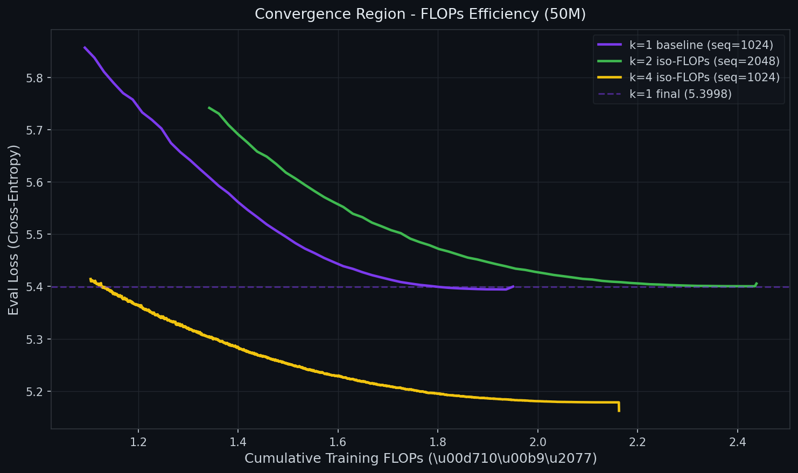
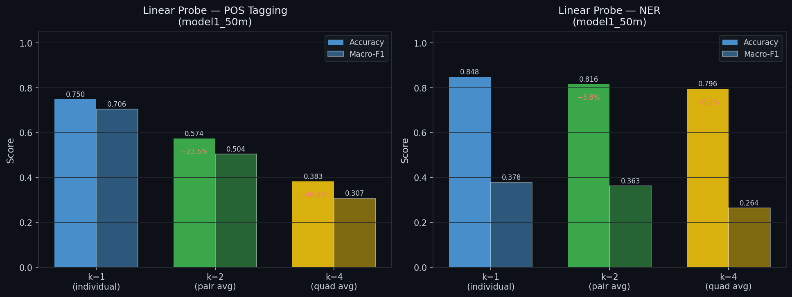

# Token Averaging for Efficient Language Model Training

*Can a transformer learn just as well from a sequence that has been pre-compressed by averaging neighbouring token embeddings — and if so, how much compute does that save?*

---

## TL;DR

We study **token averaging**: before the first transformer layer, every *k* consecutive token embeddings are collapsed into a single averaged vector. The transformer then runs on a sequence that is *k×* shorter, so each forward/backward pass is cheaper, and for a fixed compute budget the model can be shown more raw text.

The headline result at the 50M-parameter scale: a **k=4** model reaches the same validation loss as a standard model while spending **~42% fewer training FLOPs**. A **k=2** model that keeps the transformer sequence length unchanged shows **no** advantage. Together these tell a clear story — *the gain comes from shrinking the transformer's sequence length, not from merely seeing more data.* Linear-probing the averaged embeddings shows averaging mostly erases fine-grained syntactic (part-of-speech) structure while largely preserving lexical/semantic (named-entity) structure, which explains both the savings and their limits.

---

## 1. The Research Problem

Training large language models is bottlenecked by compute. The dominant cost is the transformer processing a long sequence of token positions: attention scales quadratically in sequence length and the per-token projection cost scales with model width. A natural question is whether every raw token *needs* its own transformer position.

Most efficiency work attacks this from the architecture side (sparse attention, linear attention, mixtures of experts) or the systems side (kernels, parallelism, quantisation). We ask a simpler, orthogonal question:

> **What if we compress the *input sequence itself* — before the transformer sees it — by averaging groups of neighbouring token embeddings, and let the model do next-token prediction on this shorter, denser sequence?**

If the transformer can still learn well from these blended representations, then for the *same FLOPs budget* it can consume more raw training data, because it spends fewer positions per raw token. That would be a compute-efficiency gain that composes with essentially every other technique in the stack.

---

## 2. The Idea: Token Averaging

Token embeddings are averaged **before the first transformer layer**. There is no change to the transformer itself, and the averaging operation is **static and parameter-free** — it adds no learnable weights.

```
Raw tokens:   [t1, t2, t3, t4, t5, t6, t7, t8]

k=2 average:  [avg(t1,t2), avg(t3,t4), avg(t5,t6), avg(t7,t8)]   → transformer sees 4 positions
k=4 average:  [avg(t1..t4),            avg(t5..t8)]              → transformer sees 2 positions
```

For a raw sequence of length *L* and window *k*, the transformer processes **L/k positions**, each carrying information pooled from *k* original tokens. The training objective remains next-token prediction: a compressed position predicts the first token of the *next* window (a single-token target). This keeps validation loss directly comparable to a standard model.

**Two knobs, two very different stories.** It matters whether you spend the compression on (a) shortening the transformer, or (b) widening the effective context at fixed transformer length:

- **Reduce cost** — keep the raw sequence length fixed and shrink the transformer to *L/k* positions (e.g. k=4 on a 1024-token sequence → 256 positions). Cheaper per step.
- **Extend context** — feed a *k×* longer raw sequence so the transformer still processes *L* positions but now covers *k×L* raw tokens of context (e.g. k=2 on a 2048-token sequence → 1024 positions). Same cost per step, wider window.

A core finding of this work is that these two uses behave very differently.

---

## 3. Experimental Setup

**Architecture.** OLM (OpenLanguageModel) transformer with RoPE positional encoding, SwiGLU FFN (`ff_multiplier = 2.5`), pre-norm LayerNorm, and tied input/output embeddings. Averaging is inserted between the embedding lookup and the transformer body via a thin wrapper, so the same backbone serves both baseline and averaged runs.

**Scales.**

| Scale | d_model | heads | layers | ~Params |
|-------|---------|-------|--------|---------|
| Small (preliminary) | 128 | 4 | 6 | ~8M |
| Main | 512 | 8 | 8 | ~51M (tied) |

**Data.** FineWeb web text, pre-tokenised to binary memmap files for fast loading. GPT-NeoX / Pythia BPE tokenizer (vocab 50,257).

**Training.** Multi-GPU DDP on NVIDIA RTX A6000s; bf16 autocast with TF32 enabled; AdamW (`lr ≈ 2e-4`, `weight_decay = 0.1`); cosine schedule with 2000 warmup steps; gradient clipping at 1.0. Validation loss is computed on held-out FineWeb batches with single-token prediction for every model (including averaged ones), so all curves are on the same axis.

### FLOPs Accounting

We compute training FLOPs from first principles for the actual architecture rather than relying on the rule-of-thumb `6N`:

```
Training FLOPs = sequences × n_layers × transformer_L × 3 × (23·d² + 4·transformer_L·d)
```

- `sequences = tokens_seen / seq_len`
- `transformer_L = seq_len / k` — positions actually processed after averaging
- `3×` — forward + backward
- `23·d²` — attention projections (8·d²) + SwiGLU FFN at 2.5× multiplier (15·d²)
- `4·transformer_L·d` — the two attention score matmuls (Q·Kᵀ and Attn·V)

Excluded as negligible against the matmuls: embedding lookup, LM head, LayerNorm, softmax, RoPE, activations, optimizer. The critical term for averaging is `transformer_L = seq_len / k` — it enters both the projection and the (quadratic) attention cost, which is why reducing it is what actually moves compute.

---

## 4. A Note on Rigour: the Causal-Masking Bug

Honest reporting of what went wrong is part of the result. Early in the project a bug was discovered in the attention implementation: causal masking was **not** applied even though `causal=True` was set. Models trained under this bug effectively performed **bidirectional** attention, which lets a position "see the future" and produces artificially low — and incomparable — loss values.

Every run from before the fix is therefore **invalidated** for absolute comparison. We report the corrected runs as the primary results and clearly mark pre-fix experiments as exploratory. Where a pre-fix comparison is still internally valid (e.g. all 8M models shared the same buggy attention, so their *relative* ordering holds), we say so explicitly.

**Lesson:** silent correctness bugs in the training stack can masquerade as "great results." Sanity-checking the attention mask and treating suspiciously good numbers as a red flag, not a win, saved this project from a wrong conclusion.

---

## 5. Experiments Conducted

| # | Experiment | What it tests | Status |
|---|-----------|---------------|--------|
| 1 | 8M scale (k=1, k=2, k=4) | Does averaging help at small capacity? | Preliminary |
| 2 | 50M iso-FLOPs (k=1, k=2, k=4) | Does averaging save compute at a fixed budget? | **Primary** |
| 3 | Linear probing (POS / NER) | What linguistic structure does averaging keep or destroy? | **Interpretability** |
| 4 | Phased / token-superposition training | Can a multi-token "warm-up" recover lost information? | Exploratory |
| 5 | High-k averaging (k=8…64) | How far can compression be pushed? | Exploratory |
| 6 | Mixed averaging (k=2 + k=4 in one sequence) | Does non-uniform compression help? | Exploratory |
| 7 | FLOPs-matched wide model | Can the saved compute be reinvested into width? | Exploratory |
| 8 | Method family registry (weighted / overlapping / dynamic / learnable) | Are smarter pooling schemes worth it? | Infrastructure |

The averaging method registry (`experiments/shared/averaged_lm.py`) supports far more than uniform pooling: **weighted** windows (uniform / linear / exponential / gaussian / triangular), **overlapping** windows (configurable window/stride), **dynamic** variable-length groups, a **learnable** averager, and **mixed** schemes. Uniform averaging is the workhorse for the controlled comparisons below; the others form the search space for future work.

---

## 6. Results

### 6.1 Preliminary scale: 8M parameters

| Model | Context | k | Tokens | Final eval loss |
|-------|---------|---|--------|-----------------|
| Standard baseline | 512 | 1 | 300M | 5.757 |
| Standard 2× context | 1024 | 1 | 300M | 6.086 |
| Averaging k=2 | 512 | 2 | 600M | 5.964 |
| Averaging k=4 | 512 | 4 | 800M | 6.273 |

At 8M parameters, **averaging did not beat the baseline**. The most useful reading is that the technique needs a minimum model capacity to "decode" blended representations — a small model spends its limited capacity just coping with the averaging.

> These runs predate the causal-masking fix. Because every 8M model used the same attention implementation, the *relative* ordering above is still informative even though the absolute numbers are not comparable to the corrected 50M runs.

### 6.2 Primary result: 50M parameters, iso-FLOPs comparison

The clean experiment fixes the model and asks: *given the same compute, who reaches the lower loss?* We deliberately configure k=2 and k=4 to isolate the two uses of compression from §2.

| Model | seq_len | k | transformer_L | Cost/seq | Interpretation |
|-------|---------|---|---------------|----------|----------------|
| k=1 (baseline) | 1024 | 1 | 1024 | 1× | reference |
| k=2 | 2048 | 2 | 1024 | 1× | **extend context** (same transformer length, 2× raw window) |
| k=4 | 1024 | 4 | 256 | ~¼× | **reduce cost** (4× shorter transformer) |

**Final training state (measured):**

| Model | Tokens seen | Training FLOPs | Train loss | Eval loss |
|-------|-------------|----------------|------------|-----------|
| k=1 (baseline) | 1.000B | 1.950×10¹⁷ | 5.4077 | 5.3998 |
| k=2 | 2.500B | 2.438×10¹⁷ | 5.4051 | 5.4056 |
| k=4 | 5.500B | 2.163×10¹⁷ | 5.1510 | 5.1623 |

**Iso-FLOPs slice @ 1.950×10¹⁷ FLOPs (k=1's full budget):**

| Model | Tokens at iso-FLOPs | Eval loss |
|-------|---------------------|-----------|
| k=1 | 1.000B | 5.3998 |
| k=2 | 2.005B | 5.4341 |
| k=4 | 4.960B | 5.1830 |

**FLOPs needed to *reach k=1's final loss* (5.3998):**

| Model | Tokens required | FLOPs required | FLOPs saved |
|-------|-----------------|----------------|-------------|
| k=1 | 1.000B | 1.950×10¹⁷ | — |
| k=2 | not reached at budget | — | — |
| k=4 | 2.866B | 1.127×10¹⁷ | **≈ 42%** |

### 6.3 Plots

**Loss vs tokens seen** — for a fixed compute run, k=4 consumes ~5.5× more raw tokens than k=1 (each pass is ~4× cheaper), and k=2 ~2.5× more.



**Loss vs FLOPs (linear)** — the central figure. At equal FLOPs, k=4 sits well below both k=1 and k=2. k=2 tracks k=1 almost exactly, because both have `transformer_L = 1024` and therefore identical cost per sequence.



**Loss vs FLOPs (log)** — k=4's advantage is present throughout training, not just at the endpoint.



**Convergence zoom** — the dashed line is k=1's final eval loss (5.3998); k=4 crosses it at ~1.13×10¹⁷ FLOPs vs k=1's 1.95×10¹⁷, the ~42% saving.



---

## 7. Interpreting the Results

**1. The gain is a compute-efficiency story, not a data-efficiency story.** The two iso-FLOPs configurations are designed to separate "shorter transformer" from "wider context":

- **k=4 (shorter transformer):** `transformer_L = 256`, so each step costs ~4× less. The model fits ~4× more sequences into the same budget and ends up ~0.24 nats lower. *Net win.*
- **k=2 (wider context, same transformer length):** `transformer_L = 1024`, identical cost per step to k=1. It sees 2× more raw tokens but lands at essentially the same loss (5.434 vs 5.400). *No win.*

The contrast is the punchline: **the benefit comes from reducing the number of transformer positions, not from exposing the model to more raw data per se.** When compute per sequence is held constant, the information lost to averaging roughly cancels the advantage of seeing more tokens.

**2. The trade-off is favourable only above a capacity threshold.** At 8M params averaging hurts; at 50M params k=4 clearly helps. Decoding averaged ("superposed") representations is itself a skill that costs capacity — too small a model can't afford it.

**3. Higher k is not free.** k=4 wins by being cheap per step, but it also learns from lossier inputs. The exploratory high-k runs (§9) show diminishing and eventually negative returns as compression becomes too aggressive — there is an optimal k for a given scale.

---

## 8. Interpretability: What Does Averaging Destroy?

To understand *why* averaging behaves this way, we trained **linear probes** on top of the (averaged) embeddings and measured how well simple linguistic structure survives. Tasks: **POS tagging** (syntactic) and **NER** (lexical/semantic), both from CoNLL-2003. The logic: *if accuracy collapses, averaging has destroyed that kind of structure; if it holds, the structure survives compression.*

| Task | k=1 | k=2 | k=4 | Random-embedding control (k=1) |
|------|-----|-----|-----|--------------------------------|
| **POS tagging** (acc) | 0.750 | 0.574 | 0.383 | 0.735 |
| **NER** (acc) | 0.848 | 0.816 | 0.796 | 0.805 |



**Reading the table:**

- **Syntax degrades fast.** POS accuracy falls 0.750 → 0.574 → 0.383 as k grows, dropping *below* the random-embedding control by k=4. Word-order- and position-sensitive structure is largely washed out by averaging — unsurprising, since pooling neighbours discards exactly the local ordering POS depends on.
- **Semantics is robust.** NER barely moves (0.848 → 0.796) and stays above the random control even at k=4. Entity identity is carried by *which* words are present more than by their precise order, so it survives pooling.

This is a satisfying mechanistic match to §7: averaged representations keep enough "what is being talked about" (semantic) signal to support language modelling cheaply, while sacrificing "exact local arrangement" (syntactic) signal — which is part of why aggressive k eventually hurts.

Per-class breakdowns (`plots/linear_probe_pos_per_class.png`, `plots/linear_probe_ner_per_class.png`) show the degradation is concentrated in the categories that most depend on local context.

---

## 9. Exploratory Variants

These were run largely **before** the causal-masking fix, so their absolute losses are **not** comparable to §6. They are reported to document the search space and the qualitative lessons, not as quantitative claims.

**Phased / token-superposition training.** Inspired by token-superposition training: phase 1 predicts *all k* tokens of the next window (a bag / multi-class cross-entropy), then phase 2 falls back to standard single-token prediction. The intent is to force each compressed position to retain all k tokens' information before specialising. Implemented as `OLMPhasedAveragedLanguageModel`; promising enough to revisit with corrected attention.

**High-k averaging (k = 8, 16, 32, 64).** Pushes effective context into the tens of thousands of raw tokens at fixed transformer length. Confirms that compression has a ceiling: beyond a point the information loss dominates and quality regresses.

**Mixed averaging (k=2 then k=4 within one sequence).** Non-uniform compression — finer resolution early in the sequence, coarser later. Demonstrates the registry can route different windows to different segments; a natural fit for "recent tokens matter more" intuitions.

**FLOPs-matched wide model.** A wider backbone (d≈864) sized to match a 2×-context baseline's per-FLOP cost, testing whether the compute saved by averaging is better reinvested in **width** than in **more tokens**.

**Method families (infrastructure).** Beyond uniform pooling, the codebase supports weighted (uniform/linear/exponential/gaussian/triangular), overlapping (window/stride), dynamic variable-length, and a learnable averager. These are the levers for "smarter than mean-pooling" follow-ups.

---

## 10. What We Learned

1. **Compression pays off through transformer length, not through data volume.** This is the single most important takeaway and it required the carefully matched k=2 vs k=4 design to see.
2. **There is a capacity threshold.** Averaging is a net negative for too-small models and a net positive once the model can afford to decode blended inputs.
3. **Averaging trades syntax for semantics.** Probing makes the mechanism concrete: local ordering is sacrificed, lexical identity is kept — which both enables the cheap LM gains and bounds how far k can go.
4. **Correctness first.** A causal-masking bug produced beautiful, wrong numbers. Treating "too good" results with suspicion, and rebuilding the comparison after the fix, was essential.
5. **FLOPs accounting must match the architecture.** Using the real SwiGLU/attention term (`23d² + 4Ld`) rather than `6N` matters when the whole claim is a percentage of compute.

---

## 11. Limitations & Threats to Validity

- **Single primary scale (50M).** The 42% figure is demonstrated at one model size; it must be re-validated as capacity grows.
- **Loss, not downstream tasks.** We measure validation cross-entropy. Lower loss is necessary but not sufficient — downstream benchmarks are needed to confirm the gain is meaningful.
- **Static, uniform pooling for the main result.** The headline numbers use plain mean-pooling; smarter schemes are unexplored under corrected attention.
- **Probes use input/averaged embeddings, not deep contextual states.** The interpretability story is about what averaging does to the *inputs* the transformer receives; it is suggestive of, not identical to, what the full model represents.

---

## 12. Next Steps

1. **Scale up (150M → 400M → 1B+).** Test whether the ~42% saving holds, grows, or erodes as capacity increases. Config scaffolding for 125M/150M models already exists.
2. **Find the optimal k per scale.** Larger models may tolerate more aggressive compression (higher k) — or may need less.
3. **Downstream evaluation.** Confirm the loss improvement transfers to tasks (e.g. MMLU, HellaSwag).
4. **Re-run the exploratory variants with corrected attention.** Especially phased/superposition training and the smarter pooling families.
5. **Dynamic k scheduling.** Start cheap (high k, lots of data) and anneal to fine-grained (low k) — combining the data reach of high k with the representation quality of low k.
6. **Inference-time behaviour.** Characterise the gap when a k-trained model is used for ordinary k=1 next-token generation.
7. **Compose with the rest of the stack.** Averaging is orthogonal to Flash Attention, gradient checkpointing, mixed precision, and parallelism — quantify the combined effect.
