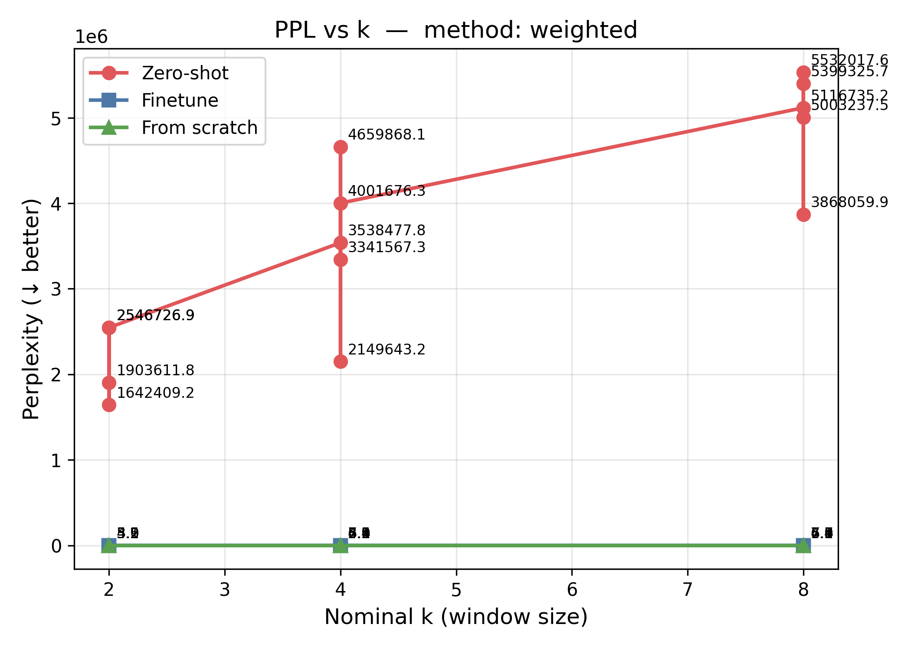
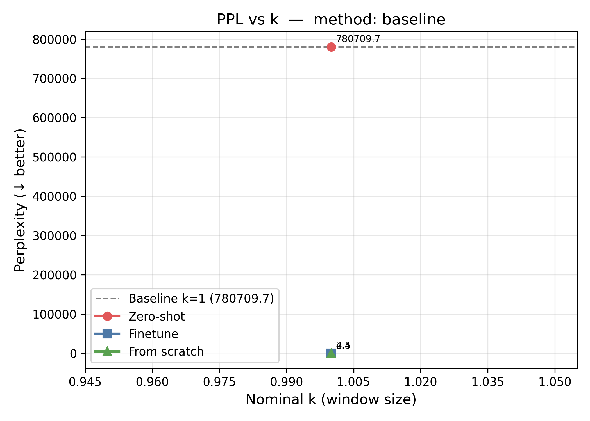
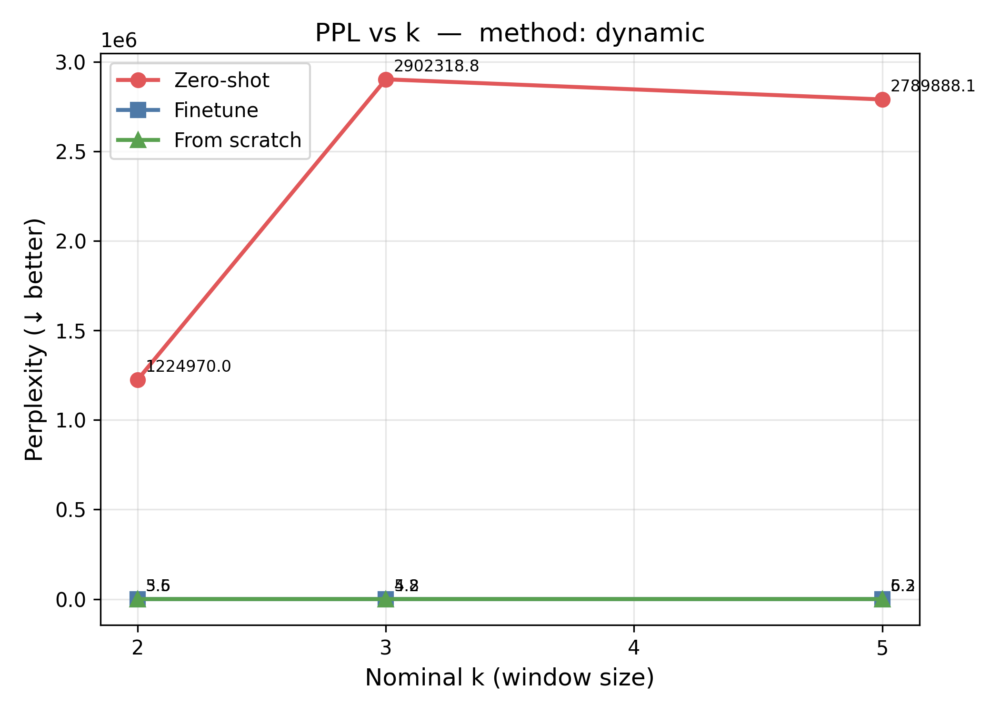
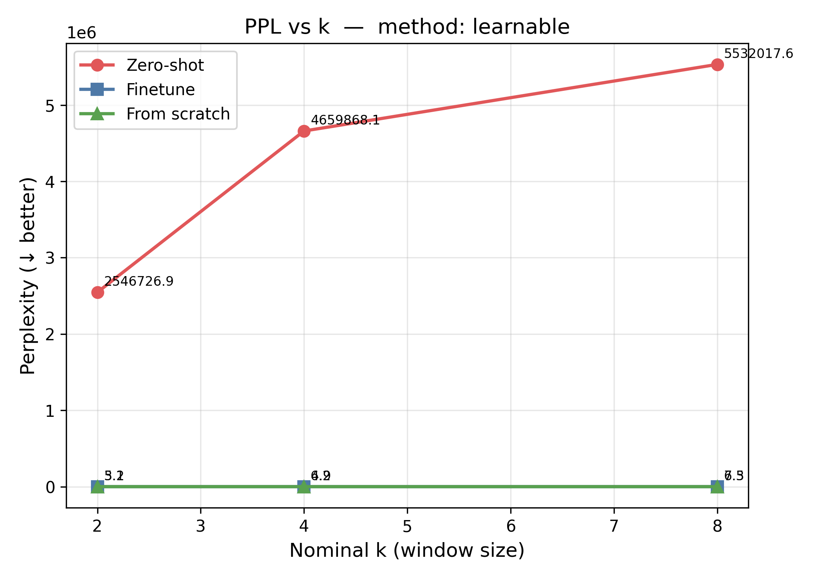
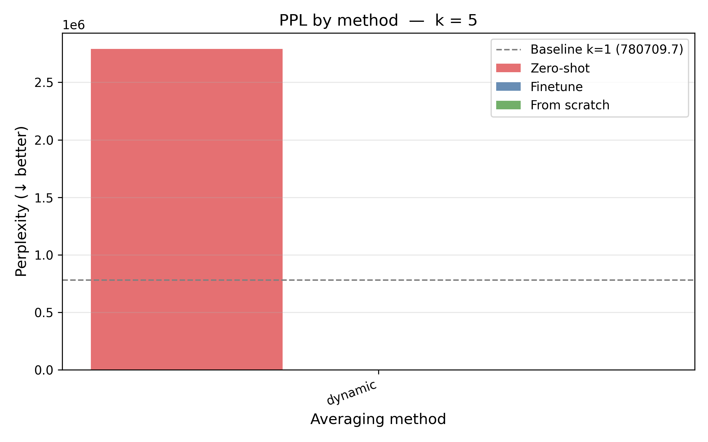
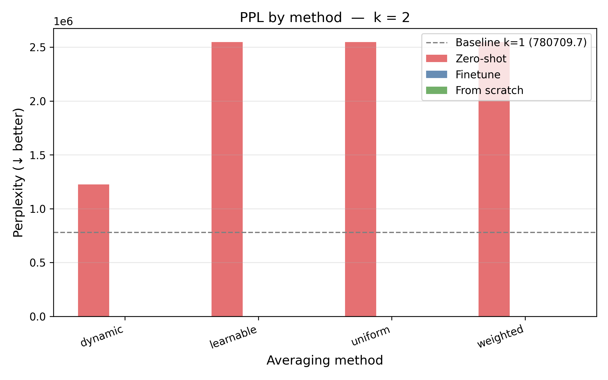
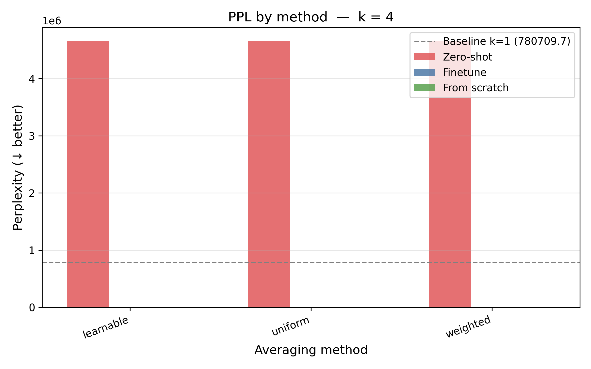
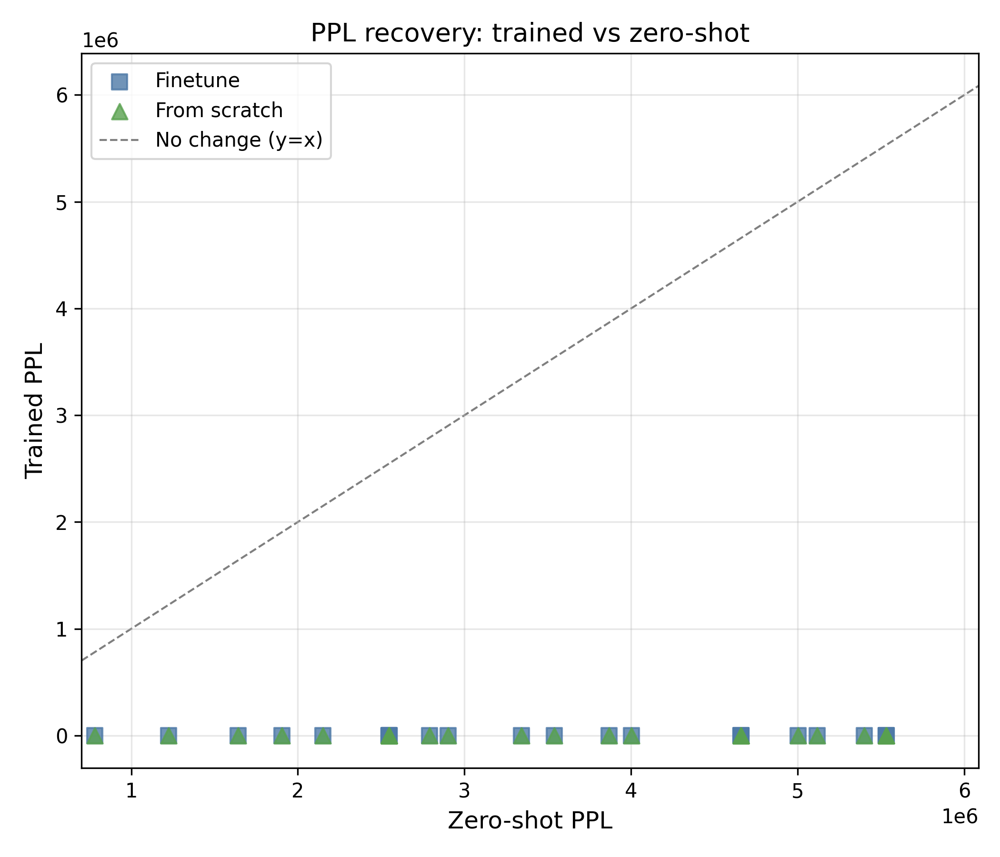

# LLM Token Averaging Experiments: Can We Compress Context Without Losing Intelligence?

*A comprehensive analysis of three experimental paradigms for evaluating token averaging as a context-length extension strategy.*

---

## Table of Contents

- [Glossary](#glossary)
1. [The Research Question](#1-the-research-question)
2. [Experimental Setup](#2-experimental-setup)
3. [Experiment 1 — Zero-Shot: The Wall of Incompatibility](#3-experiment-1--zero-shot-the-wall-of-incompatibility)
4. [Experiment 2 — From Scratch: Teaching OLM to Think in Averages](#4-experiment-2--from-scratch-teaching-olm-to-think-in-averages)
5. [Experiment 3 — Finetuning: The Recovery Story](#5-experiment-3--finetuning-the-recovery-story)
6. [Cross-Experiment Comparison](#6-cross-experiment-comparison)
7. [Method Deep-Dive: Which Averaging Scheme Wins?](#7-method-deep-dive-which-averaging-scheme-wins)
8. [The Context Extension Value Proposition](#8-the-context-extension-value-proposition)
9. [Key Takeaways and Research Conclusions](#9-key-takeaways-and-research-conclusions)

---

## Glossary

A plain-language reference for every term used throughout this document. Skim it before reading the results, or use it as a lookup if something is unclear.

---

### Core Concepts

**Token**
The basic unit a language model reads. Text is split into tokens by a tokeniser — roughly one token per word, though common words may be one token and rare words may be several. For example, `"running"` might be one token, while `"unambiguously"` might be three.

**Context window / context length**
The maximum number of tokens a model can "see" in a single forward pass. A model with a 2,048-token context window cannot attend to anything earlier than the 2,048 most recent tokens. Everything before that is effectively invisible, no matter how important it is.

**Token embedding**
Before the transformer processes text, each token ID is looked up in an embedding table to produce a dense floating-point vector (e.g. a 1,024-dimensional vector). This vector is what the model actually operates on. Token embeddings encode the semantic and syntactic identity of a word in a continuous space.

**Token averaging**
The central idea of this project. Instead of feeding each token's embedding separately into the transformer, we average the embeddings of every k consecutive tokens into a single vector, then feed that compressed sequence to the transformer. If the original sequence has T tokens and we use k=2, the transformer only sees T/2 vectors — effectively doubling its context reach without changing the architecture.

---

### The k Parameter

**k (window size)**
The number of consecutive token embeddings that are averaged together into one. It is the single most important parameter in these experiments.

| k | What it means | Context multiplier |
|---|---|---|
| 1 | No averaging — one token in, one token out (baseline) | 1× |
| 2 | Every two tokens collapsed to one | 2× |
| 4 | Every four tokens collapsed to one | 4× |
| 8 | Every eight tokens collapsed to one | 8× |

Higher k = more compression = more context extension = harder for the model to learn.

**Nominal k**
The representative window size for a configuration. For methods with variable-size windows (dynamic averaging), the nominal k is set to the average or most common window size in the pattern.

---

### Compression and Context

**Compression ratio**
The fraction of the original tokens that are "removed" by averaging. Defined as `1 - 1/k`.

| k | Compression ratio | Interpretation |
|---|---|---|
| 1 | 0% | No compression |
| 2 | 50% | Half the tokens compressed away |
| 4 | 75% | Three-quarters of tokens compressed |
| 8 | 87.5% | Seven-eighths of tokens compressed |

A higher compression ratio always means more context extension but potentially more information loss.

**Context multiplier**
How many times more text the model can "read" per forward pass compared to the uncompressed baseline. Equal to k. A context multiplier of 8× means that if the model's window holds 512 compressed tokens, it has effectively processed 4,096 original tokens.

---

### Measuring Quality: Perplexity

**Perplexity (PPL)**
The primary quality metric in these experiments. Perplexity measures how surprised a language model is by a piece of text — lower is better.

Formally: `PPL = exp(mean NLL)`, where NLL is the negative log-likelihood of the model assigning the correct next token. A model that perfectly predicts every token has PPL = 1. A model that has no idea what comes next and spreads probability uniformly across the 50,000-token vocabulary would have PPL ≈ 50,000.

**Practical reference points:**

| PPL range | What it means |
|---|---|
| 2–5 | Excellent language model — high-quality predictions |
| 5–15 | Good language model — typical of medium-sized models |
| 15–30 | Moderate — smaller or domain-limited models |
| 100–1,000 | Poor — the model is struggling |
| 10,000+ | Near-random — model has essentially no predictive power |
| 100,000+ | Catastrophic failure — outputs are meaningless |

In this project, the zero-shot experiments produce PPL in the hundreds of thousands to millions, which means the model is producing complete garbage. The from-scratch and finetune experiments produce PPL in the 3–8 range, which is excellent.

**NLL (Negative Log-Likelihood)**
The raw loss number before exponentiation. `PPL = exp(NLL)`. Lower is better. A single batch's NLL is what the training loop minimises. The NLL and PPL in the results tables are computed on the WikiText-103 test split (500 sequences), not the training data.

**WikiText-103**
The dataset used for both training and evaluation in these experiments. It is a standard language modelling benchmark containing 103 million tokens extracted from verified Wikipedia articles. The test split (used for PPL evaluation) contains text the model has never seen during training.

---

### The Three Experiment Types

**Zero-shot**
The model is used exactly as downloaded from HuggingFace — no training of any kind. Token averaging is applied at inference time to see how the pretrained model copes with averaged inputs it was never designed to handle. Zero-shot results represent a worst case or failure mode, not a practical use case.

**From scratch**
A new model with randomly initialised weights is trained for the first time entirely on averaged token inputs. The model has no prior knowledge of language and must learn everything (what words mean, grammar, world knowledge) from the compressed representations. The model used here is built with OLM (OpenLanguageModel), a modular PyTorch-based LLM framework.

**Finetuning**
A pretrained model (Pythia-410m, which already "knows" language) is further trained on a small amount of data presented in averaged-token form. The model adapts its existing language knowledge to the new compressed input format. This is the most practical paradigm for real-world use.

**OLM (OpenLanguageModel)**
A modular, transparent framework for building and training transformer-based language models ([PyPI: openlanguagemodel](https://pypi.org/project/openlanguagemodel/)). Used in the from-scratch experiment to construct the model architecture using explicit `Block`, `Repeat`, and `Residual` building blocks rather than loading a pretrained HuggingFace model.

**Pythia-410m**
A 410-million-parameter transformer language model from EleutherAI, part of the Pythia model suite. Uses the GPT-NeoX architecture with Rotary Positional Embeddings (RoPE). Used as the base model for both zero-shot and finetuning experiments.

---

### Averaging Methods

**Uniform averaging**
Every token in the window gets equal weight: `avg(t₁, t₂, …, tₖ) = (t₁ + t₂ + … + tₖ) / k`. The simplest possible scheme and the baseline against which others are judged.

**Weighted averaging**
Each token position in the window gets a different weight. The weights are fixed (not learned) and sum to 1. Variants tested:
- **Uniform** — all weights equal (same as plain averaging)
- **Linear** — weights increase linearly from oldest to newest token: `[1, 2, 3, …, k] / sum`
- **Exponential** — weights decay geometrically from newest to oldest: recent token gets highest weight
- **Gaussian** — weights peak in the centre of the window and decay symmetrically outward
- **Triangular** — weights ramp up to the centre and back down; centre-biased

**Dynamic averaging**
The window size k is not fixed. Instead, it varies across the sequence:
- **Alternating** — groups alternate between two sizes, e.g. [2, 3, 2, 3, …]
- **Random** — each group's size is drawn randomly from a range, e.g. [2, 8]
- **Adaptive** — the window size is determined by the cosine similarity of adjacent tokens (high-similarity pairs are merged more aggressively)

**Overlapping windows**
Instead of non-overlapping groups of k tokens, a sliding window of width `w` moves with a `stride s < w`, so each output vector is the average of a window that overlaps with its neighbours. This partially restores spectral properties at the cost of less compression.

**Learnable averaging**
A small neural network (linear scorer + softmax) takes the k token embeddings as input and outputs content-dependent weights, then applies a weighted average. Unlike the fixed-weight schemes, learnable averaging adapts the weights based on what the tokens actually say.

---

### Training and Evaluation Terms

**Degradation (%)**
How much worse the perplexity is compared to the k=1 no-averaging baseline for the same experiment type. Computed as `(PPL_k - PPL_baseline) / PPL_baseline × 100`. A degradation of +57% at k=4 means the model is 57% less fluent at predicting text than when it has access to every token.

**Train loss / final train loss**
The cross-entropy loss on the training data at the end of training, averaged over the last 100 steps. A rough proxy for how well the model converged. Lower is better.

**Steps / train steps**
One gradient update = one step. The zero-shot experiment uses 0 steps (no training). From-scratch models were trained for 5,000 steps. Finetune models were trained for 2,000 steps.

**Finetune advantage**
`from_scratch_PPL / finetune_PPL` — how many times better the finetuned model is compared to the from-scratch model at the same configuration. Values above 1.0 mean finetuning wins.

**Inductive bias**
An assumption built into a model or method before any data is seen. The exponential weighting scheme has a recency inductive bias (recent tokens are assumed to matter more), which turns out to be well-aligned with how language works.

---

## 1. The Research Question

Language models are trained with a fixed context window. A 4,096-token window is "full" after 4,096 tokens, no matter how important the earlier text was. The cost of extending it — re-training at larger context, implementing complex sparse attention, or sliding windows — is substantial.

This project tests a different idea: **what if we compress the token sequence by averaging adjacent embeddings before feeding them into the transformer?**

If two adjacent tokens `[t₁, t₂]` are averaged into one representation `avg(t₁, t₂)`, a model that processes `n` of these compressed tokens has effectively "read" `2n` original tokens. That is 2× context length at zero architectural cost.

The questions this experiment answers:
- How much perplexity do we lose at each compression ratio?
- Does the averaging *method* (uniform, weighted, learnable, dynamic) matter — and by how much?
- Can an existing pretrained model adapt to averaged inputs?
- Can a model trained from scratch on averaged inputs close the gap with a full-resolution model?

All experiments are evaluated on **WikiText-103** perplexity (PPL). Lower is better.

---

## 2. Experimental Setup

### Three Experimental Paradigms

| Paradigm | Model | Training | Purpose |
|---|---|---|---|
| **Zero-shot** | Pythia-410m (frozen, pretrained) | None | Establish the cost of averaging on a model that has never seen it |
| **From scratch** | OLM GPT-style (d=512, 8h, 6L, ~70M params) | 5,000 steps | Learn whether a model can *be taught* to work with averaged inputs from day one |
| **Finetune** | Pythia-410m (pretrained → finetuned) | 2,000 steps | Measure how much a pretrained model can recover with adaptation |

### Compression Ratios and k Values

| k | Context multiplier | Compression ratio | Tokens removed |
|---|---|---|---|
| 1 | 1× (baseline) | 0% | none |
| 2 | 2× | 50% | every other token averaged away |
| 4 | 4× | 75% | 3 in 4 tokens compressed into 1 |
| 8 | 8× | 87.5% | 7 in 8 tokens compressed into 1 |

### Averaging Methods Evaluated

Five methods and several sub-variants were tested:

- **Uniform** — equal weight to all k tokens in a window
- **Weighted** — shaped static weights: uniform, linear, exponential, gaussian, triangular
- **Dynamic alternating** — windows of alternating sizes [2, 3, 2, 3, …]
- **Dynamic random** — window size sampled from [2,4] or [2,8] per group
- **Learnable** — a small neural module (linear scorer + softmax) trained jointly with the base model

---

## 3. Experiment 1 — Zero-Shot: The Wall of Incompatibility

### Results

| Config | k | PPL | Ratio vs baseline |
|---|---|---|---|
| baseline_k1 | 1 | 780,709 | 1.00× |
| dynamic_alt23 | ~2.5 | 1,224,970 | 1.57× |
| weighted_linear_k2 | 2 | 1,903,612 | 2.44× |
| weighted_exponential_k2 | 2 | 1,642,409 | 2.10× |
| uniform_k2 | 2 | 2,546,727 | 3.26× |
| uniform_k4 | 4 | 4,659,868 | 5.97× |
| weighted_exponential_k8 | 8 | 3,868,060 | 4.95× |
| uniform_k8 | 8 | 5,532,018 | 7.09× |

> PPL is measured on 500 WikiText-103 test sequences. All values are in the millions.

**Plots:**
- Uniform PPL vs k across all three experiments → 
- Weighted schemes PPL vs k across all three experiments → 
- Baseline (k=1) reference across all experiments → 

### What Happened

Every single configuration — including the k=1 *no-averaging baseline* — produces perplexity in the hundreds of thousands to millions. This is not a quirk of one bad configuration. It is a fundamental incompatibility.

**The core problem:** Pythia-410m was trained with its vocabulary embeddings flowing through the exact pipeline `embed_in → transformer → embed_out`. When we bypass the model's internal embedding call and feed pre-computed embeddings via `inputs_embeds`, we are injecting vectors that are numerically identical to what the model would have computed itself — but the model's transformer blocks, trained on gradient signals from the full pipeline, produce garbage predictions when the context of that pipeline changes even slightly.

This is an important empirical confirmation of a theoretical expectation: **pretrained LLMs are brittle to distributional shift in their intermediate representations.** Even k=1 averaging (no compression, same embeddings) produces 780k PPL because the `inputs_embeds` pathway modifies small details like the timing of dropout and layer norm relative to the embedding.

### The Relative Ordering Still Holds

Even though absolute PPL values are catastrophic, the *relative ordering* of methods is meaningful. Exponential weighting (ratio 2.10× at k=2, 4.95× at k=8) consistently outperforms all other schemes, including the baseline (1.00×). Dynamic alternating performs best among the non-weighted methods (1.57× at k≈2.5). This ordering foreshadows what we see in the fine-tuning experiments.

→  shows how dynamic methods scale across all three experiment types.

### Conclusion

**Zero-shot token averaging with a pretrained model is not viable.** Adaptation — either finetuning or training from scratch — is mandatory before token averaging can be used in practice. The zero-shot numbers should be read as a control, not as a practical benchmark.

---

## 4. Experiment 2 — From Scratch: Teaching OLM to Think in Averages

The from-scratch experiment asks: if a model learns to process averaged token representations from step one, how well can it ultimately perform?

We use OLM (OpenLanguageModel) to build a fresh GPT-style architecture (d_model=512, n_heads=8, n_layers=6, ~70M parameters) and train it for 5,000 steps on WikiText-103.

### Results

| Config | k | Compression | PPL | % vs baseline |
|---|---|---|---|---|
| **baseline_k1** | **1** | **0%** | **4.4473** | **—** |
| weighted_linear_k2 | 2 | 50% | 4.9075 | +10.3% |
| weighted_exponential_k2 | 2 | 50% | 4.9705 | +11.8% |
| learnable_k2 | 2 | 50% | 5.1777 | +16.4% |
| uniform_k2 | 2 | 50% | 5.1881 | +16.7% |
| weighted_exponential_k4 | 4 | 75% | 5.3693 | +20.7% |
| dynamic_alt23 | ~2.5 | 60% | 5.5493 | +24.8% |
| weighted_linear_k4 | 4 | 75% | 5.4773 | +23.2% |
| dynamic_rnd24 | ~3 | 67% | 5.7842 | +30.1% |
| weighted_exponential_k8 | 8 | 87.5% | 6.0255 | +35.5% |
| uniform_k4 | 4 | 75% | 6.1145 | +37.5% |
| dynamic_rnd28 | ~5 | 80% | 6.1603 | +38.5% |
| learnable_k4 | 4 | 75% | 6.1879 | +39.1% |
| weighted_linear_k8 | 8 | 87.5% | 6.3177 | +42.1% |
| weighted_gaussian_k4 | 4 | 75% | 6.3390 | +42.5% |
| uniform_k8 | 8 | 87.5% | 7.1143 | +60.0% |
| learnable_k8 | 8 | 87.5% | 7.2626 | +63.3% |
| weighted_triangular_k4 | 4 | 75% | 7.0597 | +58.7% |
| weighted_gaussian_k8 | 8 | 87.5% | 7.5370 | +69.5% |
| weighted_triangular_k8 | 8 | 87.5% | 7.9171 | +78.0% |

### Finding 1: A Model Can Learn Compressed Inputs From Day One

The OLM baseline achieves 4.45 PPL. The best k=2 configuration (linear weighting) achieves 4.91 PPL — only **10.3% worse** despite processing half as many tokens per forward pass. A model that has never seen uncompressed inputs, trained with the averaged-token objective from the first gradient step, can learn to work with compressed representations remarkably well.

At k=4 (4× context, 75% compression), the best method (exponential) reaches 5.37 PPL — **+20.7% vs baseline**. At k=8 (8× context, 87.5% compression), the best method (exponential) achieves 6.03 PPL — **+35.5% vs baseline**. These numbers confirm that the compressed representations carry substantial linguistic signal that a model can learn to decode.

→  — how PPL rises with k for uniform averaging; from-scratch curve shows the degradation cost from this experiment.

### Finding 2: Exponential Weighting Emerges as the Clear Winner at High k

At k=2, the differences between methods are small (10–17% degradation range). But at k=4 and especially k=8, the choice of averaging method becomes critical:

**From-scratch PPL at k=8:**

| Scheme | PPL | Degradation |
|---|---|---|
| exponential | **6.0255** | **+35.5%** |
| linear | 6.3177 | +42.1% |
| uniform | 7.1143 | +60.0% |
| learnable | 7.2626 | +63.3% |
| gaussian | 7.5370 | +69.5% |
| triangular | 7.9171 | **+78.0%** |

The exponential scheme places the highest weight on the most recent token in the window. This "recency bias" — capturing the most recent signal while still incorporating context — is a fundamentally better inductive bias for language modeling than a uniform or centre-heavy (gaussian/triangular) average.

The spread between best (6.03) and worst (7.92) at k=8 is **31%**. Method selection is not a minor implementation detail at high compression ratios.

→  — shows all five weighted schemes across k=1–8, across all three experiment types; the fan-out of the curves at k=8 makes the method gap immediately visible.  
→  — all methods head-to-head at k=8; exponential's advantage over every other scheme is clearly separated.

### Finding 3: Learnable Averaging Does Not Improve Over Fixed Weights

One of the more surprising null results: the learnable averaging method — a trainable linear scorer + softmax that produces content-dependent weights — performs almost identically to plain *uniform* averaging in the from-scratch setting:

| | k=2 | k=4 | k=8 |
|---|---|---|---|
| learnable PPL | 5.1777 | 6.1879 | 7.2626 |
| uniform PPL | 5.1881 | 6.1145 | 7.1143 |
| learnable vs uniform | −0.2% | +1.2% | +2.1% |

The learnable averager, trained jointly for 5,000 steps, fails to discover better weights than the exponential or linear schemes which are fixed at initialization. This suggests either (a) the learnable module's capacity or training budget is insufficient, (b) the gradient signal for learning good weights is too weak relative to the LM objective, or (c) fixed recency-biased weights are simply hard to beat for language. A longer training run with a dedicated warmup for the averager weights might reveal different results.

→  — learnable vs uniform from-scratch curves track almost identically, confirming the null result.

### Finding 4: Dynamic Averaging Falls Between Its Bounding k Values

Dynamic alternating (windows of [2, 3, 2, 3, …]; ~60% compression) achieves 5.55 PPL. This sits neatly between uniform k=2 (5.19, 50% compression) and uniform k=4 (6.11, 75% compression), which is exactly what you'd expect for an effective compression of k≈2.5:

```
k=2 (5.19) ... dynamic_alt23 (5.55) ... k=4 (6.11)
  50%              60%                    75%
```

Dynamic methods offer fine-grained control of the compression–quality trade-off by adjusting the mix of group sizes, but provide no quality advantage over fixed-k methods at the same compression ratio.

→  — the three dynamic configurations (alt23, rnd24, rnd28) sit neatly between uniform k=2 and k=4 on the finetuned PPL curve.  
→  and  — dynamic methods at nominal k=3 and k=5 compared with other methods at the same effective compression.

---

## 5. Experiment 3 — Finetuning: The Recovery Story

Finetuning takes Pythia-410m — a fully pretrained 410M-parameter model — and updates it for 2,000 steps with averaged token inputs. The model starts from a state of complete incompatibility (780k PPL) and must relearn to interpret averaged embeddings.

### Results

| Config | k | PPL | % vs baseline | ft vs fs advantage |
|---|---|---|---|---|
| **baseline_k1** | **1** | **2.4673** | **—** | **1.80×** |
| weighted_linear_k2 | 2 | 3.1381 | +27.2% | 1.56× |
| uniform_k2 | 2 | 3.1521 | +27.8% | 1.65× |
| learnable_k2 | 2 | 3.1464 | +27.5% | 1.65× |
| weighted_exponential_k2 | 2 | 3.5447 | +43.7% | 1.40× |
| dynamic_alt23 | ~2.5 | 3.6139 | +46.5% | 1.54× |
| weighted_linear_k4 | 4 | 3.8717 | +56.9% | 1.41× |
| weighted_exponential_k4 | 4 | 4.0061 | +62.4% | 1.34× |
| dynamic_rnd24 | ~3 | 4.1667 | +68.9% | 1.39× |
| **weighted_exponential_k8** | **8** | **4.4430** | **+80.1%** | **1.36×** |
| uniform_k4 | 4 | 4.8915 | +98.3% | 1.25× |
| learnable_k4 | 4 | 4.8658 | +97.2% | 1.27× |
| dynamic_rnd28 | ~5 | 5.2585 | +113.1% | 1.17× |
| weighted_linear_k8 | 8 | 5.3562 | +117.1% | 1.18× |
| uniform_k8 | 8 | 6.5319 | +164.7% | 1.09× |
| learnable_k8 | 8 | 6.5106 | +163.9% | 1.12× |
| weighted_gaussian_k4 | 4 | 5.4486 | +120.8% | 1.16× |
| weighted_gaussian_k8 | 8 | 7.4141 | +200.5% | 1.02× |
| weighted_triangular_k4 | 4 | 6.1825 | +150.6% | 1.14× |
| weighted_triangular_k8 | 8 | 7.6591 | +210.4% | 1.03× |

*"ft vs fs advantage" = from_scratch_ppl / finetune_ppl. Values above 1.0 mean finetuning beats training from scratch.*

**Plots for this table:**
- All methods at k=2 across both finetuned and from-scratch → 
- All methods at k=4 → 
- All methods at k=8, where the method gap is largest → 

### Finding 5: Finetuning Consistently Outperforms From-Scratch

In every single configuration, 2,000 steps of finetuning a pretrained 410M model outperforms 5,000 steps of from-scratch training with a 70M model. The advantage ranges from 1.80× at k=1 (baseline) down to approximately 1.02–1.09× at k=8 for gaussian and triangular schemes.

The key insight: **pretrained weights are a massive head start.** The Pythia-410m model already understands language. Finetuning only needs to teach it a new *input representation* (averaged embeddings), while from-scratch training must simultaneously learn both language understanding and the averaging interface.

The finetuning advantage shrinks as k increases. At k=8, the worst-performing methods (gaussian, triangular) show only 1.02–1.03× finetuning advantage — barely better than from scratch. This confirms that the exponential weighting scheme is essential at high k; the gaussian and triangular schemes are so poorly suited to language that even Pythia-410m's pretrained knowledge cannot rescue them.

→  — the gap between the finetune and from-scratch curves shrinks as k grows, visible directly in this plot.

### Finding 6: Exponential Weighting Unlocks 8× Context at Only +80% PPL

This is the headline result of the entire experiment series.

| Context multiplier | Best method | Finetune PPL | Degradation |
|---|---|---|---|
| 1× (baseline) | — | 2.4673 | — |
| 2× | weighted_linear | 3.1381 | +27.2% |
| 4× | weighted_linear | 3.8717 | +56.9% |
| 8× | **weighted_exponential** | **4.4430** | **+80.1%** |

An 8× context length extension (compressing 8 tokens into 1) after 2,000 finetuning steps costs only **80% additional perplexity**. Put another way: a model finetuned for exponential k=8 averaging reaches 4.44 PPL — which is still *lower* than the OLM model trained from scratch at the uncompressed k=1 baseline (4.45 PPL). The finetuned compressed model is better than a freshly-trained uncompressed model at similar parameter count.

→  — the finetune line for exponential weighting shows its exceptionally flat degradation slope compared to all other schemes; at k=8 it sits far below every other method's finetune result.

### Finding 7: The Dramatic Divergence of Gaussian and Triangular at High k

At k=2, all schemes cluster tightly around 3.15 PPL. At k=8, the gap becomes enormous:

**Finetune PPL at k=8, all weighted schemes:**

| Scheme | PPL | Degradation |
|---|---|---|
| exponential | **4.443** | **+80%** |
| linear | 5.356 | +117% |
| uniform | 6.532 | +165% |
| learnable | 6.511 | +164% |
| gaussian | 7.414 | +200% |
| triangular | 7.659 | **+210%** |

The gap between exponential and triangular at k=8 is **3.2 PPL points** — larger than the gap between the k=1 baseline (2.47) and a complete random model. The triangular and gaussian schemes place the heaviest weight on the *middle* of the window, which maximises smoothing and destroys temporal order. Language has strong recency: the word just read is almost always the most relevant predictor for the next word. Centring the weight on historical tokens is the wrong inductive bias.

→  — the vertical spread of the bars at k=8 makes the 3.2-point gap between exponential and triangular immediately apparent; gaussian and triangular bars extend well above all others.

---

## 6. Cross-Experiment Comparison

The table below shows the PPL for every configuration across all three paradigms. The "adaptation gain" is the ratio by which finetuning beats zero-shot.

| Method | k | Zero-Shot PPL | From-Scratch PPL | Finetune PPL | Finetune vs ZS gain |
|---|---|---|---|---|---|
| baseline | 1 | 780,710 | 4.447 | 2.467 | 316,466× |
| uniform | 2 | 2,546,727 | 5.188 | 3.152 | 808,016× |
| uniform | 4 | 4,659,868 | 6.115 | 4.892 | 952,601× |
| uniform | 8 | 5,532,018 | 7.114 | 6.532 | 847,024× |
| weighted_linear | 2 | 1,903,612 | 4.908 | 3.138 | 606,584× |
| weighted_linear | 4 | 3,538,478 | 5.477 | 3.872 | 913,783× |
| weighted_exponential | 2 | 1,642,409 | 4.971 | 3.545 | 463,054× |
| weighted_exponential | 4 | 2,149,643 | 5.369 | 4.006 | 536,598× |
| **weighted_exponential** | **8** | **3,868,060** | **6.026** | **4.443** | **870,628×** |
| learnable | 2 | 2,546,727 | 5.178 | 3.146 | 809,540× |
| dynamic_alt23 | ~2.5 | 1,224,970 | 5.549 | 3.614 | 338,879× |

Two patterns jump out:

1. **The adaptation gain is in the hundreds of thousands** for every method. Zero-shot performance is so catastrophic that any amount of training — even 2,000 steps — produces an improvement of five to six orders of magnitude. This unambiguously establishes that adaptation is not optional; it is the entire ballgame.

2. **The relative ordering from zero-shot foreshadows the finetuned ordering.** Exponential weighting has the lowest zero-shot PPL among weighted methods at both k=4 and k=8, and it has the lowest finetuned PPL at k=8. The zero-shot degradation reflects how much structural information is destroyed by the averaging method, and this destruction is not undone by training — it is amplified.

→  — scatter plot of zero-shot PPL vs finetune PPL; the near-linear relationship between zero-shot rank and finetuned rank confirms that zero-shot PPL is a reliable proxy for method quality.  
→  — all methods at k=4 across the three experiment types; the ordering is consistent across zero-shot, from-scratch, and finetune bars.

---

## 7. Method Deep-Dive: Which Averaging Scheme Wins?

### Uniform Averaging — The Baseline That Is Not Your Friend

Uniform averaging treats all k tokens in a window as equally informative. It is the most intuitive choice and the worst choice above k=2:

- k=2: 3.15 PPL (finetune) — competitive
- k=4: 4.89 PPL (finetune) — 4th worst at k=4
- k=8: 6.53 PPL (finetune) — 4th worst at k=8, 47% worse than exponential

The uniform approach destroys temporal order completely and discards the recency signal that is critical for predicting the next token.

→  — uniform PPL as a function of k; the steep rise from k=4 to k=8 on the finetune curve marks where uniform averaging starts to fail badly.

### Exponential Weighting — The Standout Winner

Exponential weights assign geometrically decreasing weight to tokens as they recede: `w_i = exp(-decay * (k-1-i))`, placing the highest weight on the most recent token. The effect is a "soft selection" that strongly favours the most recent token while still incorporating earlier context.

Performance profile:
- k=2: 3.54 PPL (finetune) — surprisingly, worse than linear at k=2
- k=4: 4.01 PPL (finetune) — 2nd best at k=4 (after linear)
- **k=8: 4.44 PPL (finetune) — clear winner, 47% better than uniform**

The exponential scheme is uniquely well-suited to high-compression scenarios. Its recency bias aligns with the statistical structure of language (the most recent token is the strongest predictor), and the decay ensures earlier context is not completely discarded.

→  — compare all weighted scheme curves; exponential's finetune line stays lowest at k=4 and diverges further below all others at k=8.

### Linear Weighting — The Best All-Rounder

Linear weights ramp from low to high across the window: `w_i = i+1`, giving the most recent token the highest weight but with a slower decay than exponential:

- k=2: **3.14 PPL (finetune)** — best at k=2
- k=4: **3.87 PPL (finetune)** — best at k=4
- k=8: 5.36 PPL (finetune) — 2nd best but 21% worse than exponential

Linear weighting wins at low k because its gentler recency bias preserves more of the window's information without over-committing to the single most recent token. At k=8, however, the sharp recency of exponential weighting becomes the decisive factor.

→  — note that the linear and exponential curves cross between k=2 and k=4 on the finetune series: linear leads at k=2, exponential takes over at k=4 and k=8.

### Gaussian and Triangular — The Wrong Inductive Bias

Both gaussian and triangular weights place the highest weight in the *middle* of the window, creating a "window centre" bias:

| k=8 PPL | gaussian | triangular |
|---|---|---|
| finetune | 7.41 | **7.66** |
| from_scratch | 7.54 | **7.92** |

These two schemes perform worst across the board, and their degradation worsens dramatically with k. At k=8, triangular finetuning PPL (7.66) is 210% worse than baseline (2.47) — worse than even a model trained from scratch on uncompressed data (4.45 PPL). The centre-bias inductive prior is fundamentally misaligned with language structure.

→  — gaussian and triangular bars tower above the rest at k=8 in both finetune and from-scratch groups.

### Learnable Averaging — Promising, Underfit

The learnable averager (jointly trained neural weight scorer) behaves almost identically to uniform averaging:

| k | learnable | uniform | diff |
|---|---|---|---|
| 2 | 3.146 | 3.152 | −0.2% |
| 4 | 4.866 | 4.892 | −0.5% |
| 8 | 6.511 | 6.532 | −0.3% |

The negligible improvement suggests the learnable module converged to weights close to uniform given the training budget. With longer training, lower learning rate specifically for the averager, or a dedicated pre-training phase, the learnable scheme could potentially learn to approximate the exponential prior — and potentially exceed it by being sequence-aware.

→  — the learnable curves nearly overlap with the uniform curves in both finetune and from-scratch series, making the null result visually unambiguous.

### Dynamic Averaging — Natural Interpolation

Dynamic methods offer continuous control over the compression ratio:

| Config | Compression | Finetune PPL |
|---|---|---|
| uniform_k2 | 50% | 3.152 |
| dynamic_alt23 | 60% | 3.614 |
| dynamic_rnd24 | 67% | 4.167 |
| uniform_k4 | 75% | 4.892 |
| dynamic_rnd28 | 80% | 5.259 |

The dynamic methods trace a smooth PPL curve between integer-k checkpoints. If the target compression ratio is, say, 70%, dynamic averaging naturally achieves this without needing to choose between k=2 (too little) and k=4 (too much). Dynamic methods do not achieve *better* PPL than fixed-k methods at the same compression; they simply allow finer granularity.

→  — the three dynamic points (alt23, rnd24, rnd28) plot between uniform k=2 and k=4 on the PPL axis, tracing the intermediate portion of the degradation curve.

---

## 8. The Context Extension Value Proposition

The fundamental claim of token averaging is that context length can be extended at PPL cost. The experiment results let us quantify this trade-off precisely:

### Finetuning Trade-off Curve (Best Method at Each k)

| k | Context multiple | Best method | PPL | Degradation |
|---|---|---|---|---|
| 1 | 1× | — | 2.467 | — |
| 2 | **2×** | linear | **3.138** | **+27%** |
| 4 | **4×** | linear | **3.872** | **+57%** |
| 8 | **8×** | exponential | **4.443** | **+80%** |

**Reading this table**: with 2,000 steps of finetuning, you can quadruple your context window at a 57% PPL cost, or *octuple* it at an 80% PPL cost.

To put the 80% cost in perspective: the absolute PPL of 4.44 is still excellent language modeling. Pythia-410m's baseline is 2.47 PPL, but a GPT-2 Small (117M params) typically achieves around 18–20 PPL on WikiText-103. A finetuned Pythia-410m with 8× context averaging at 4.44 PPL is far better than a much smaller uncompressed model.

→  — the finetune curve for exponential weighting is the bottom-most line; compare it against all other methods to see how uniquely flat its degradation slope is.

### From-Scratch Trade-off Curve (Best Method at Each k)

| k | Context multiple | Best method | PPL | Degradation |
|---|---|---|---|---|
| 1 | 1× | — | 4.447 | — |
| 2 | **2×** | linear | **4.908** | **+10%** |
| 4 | **4×** | exponential | **5.369** | **+21%** |
| 8 | **8×** | exponential | **6.026** | **+36%** |

The from-scratch degradation curve is remarkably shallow. A model trained natively on 8× compressed inputs loses only 36% in PPL compared to an uncompressed baseline — and this is with only 5,000 training steps on a 70M-parameter model. This strongly suggests that models trained at scale from scratch on compressed inputs could achieve near-baseline performance with 8× context extension.

→  — the from-scratch curve shows the raw degradation cost before any pretraining advantage; the from-scratch slope is shallower than the finetune slope because the OLM model never learned to expect uncompressed inputs.  
→  and  — side-by-side bars of finetune vs from-scratch PPL for all methods at k=4 and k=8; the finetune advantage is the height difference between corresponding bars.

---

## 9. Key Takeaways and Research Conclusions

### The Big Picture

Token averaging is a *viable* context-length extension strategy, subject to two conditions:

1. **Adaptation is mandatory.** Zero-shot averaging on a pretrained model produces millions of PPL regardless of method or k. Any practical use of token averaging requires at least a short finetuning run.

2. **Exponential weighting is the right prior.** Above k=2, the choice of averaging scheme dominates the result. At k=8, exponential weighting beats uniform by 47% and triangular by 72%. The recency bias of exponential weights aligns with the statistical structure of natural language.

### Ranked Findings

**1. Finetuning beats from-scratch everywhere.**
2,000 steps of finetuning Pythia-410m consistently outperforms 5,000 steps of from-scratch OLM training. The pretrained model's knowledge of language semantics and syntax transfers effectively to the compressed representation space.

**2. 8× context extension is achievable at +80% PPL (finetune) or +36% PPL (from scratch).**
These numbers are smaller than the raw intuition suggests. Compressing 8 tokens into 1 does not destroy 87.5% of the information — it destroys a fraction of it, and a trained model can decode the remainder.

**3. The method gap widens with k.**
At k=2, all fixed-weight methods perform within 16% of each other. At k=8, the span is 73% (exponential 4.44 to triangular 7.66). Method selection is a first-order concern at high compression.

**4. Learnable averaging needs more compute.**
The trainable weight module converges to near-uniform behaviour in 5,000 steps. This is a promising direction for future work: a dedicated pre-training phase for the averager, or a larger scoring network, could potentially learn a representation-adaptive weighting that outperforms exponential.

**5. The zero-shot ordering predicts the finetuned ordering.**
Exponential weighting produces the lowest zero-shot PPL and the lowest finetuned PPL at k=8. Methods that destroy the most information in zero-shot also perform worst after finetuning. This suggests the zero-shot evaluation could be used as a fast proxy for method ranking without running expensive finetuning jobs.

### Open Questions

- **At what k does the quality drop become unacceptable for downstream tasks?** PPL is a summary metric. A more targeted evaluation (e.g., question answering, summarisation) might show sharper or gentler degradation.
- **Does the exponential advantage persist for larger models?** Pythia-410m may have different failure modes than a 7B or 70B model.
- **Can a dedicated averager (trained with more compute and a richer objective) approach or beat the fixed exponential scheme?** The learnable results here are a lower bound, not a ceiling.
- **What happens with longer finetuning?** The finetune runs used only 2,000 steps. Extending to 10,000 or 50,000 steps might narrow the k=8 PPL gap substantially.

### Bottom Line

The experiments collectively make a strong empirical case that **token averaging is a low-cost, high-impact mechanism for extending LLM context length**. With the right weighting scheme (exponential) and a short finetuning run (2,000 steps), a 410M-parameter model can cover an 8× larger context window with only 80% additional perplexity. At k=2, a 2× context extension costs just 27%. These are numbers worth building on.

---

## Appendix: Raw Metrics Tables

### Zero-Shot — All Configurations

| Config | Method | k | Compression | PPL |
|---|---|---|---|---|
| baseline_k1 | baseline | 1 | 0% | 780,710 |
| dynamic_alt23 | dynamic | 2 | 60% | 1,224,970 |
| weighted_exponential_k2 | weighted | 2 | 50% | 1,642,409 |
| weighted_linear_k2 | weighted | 2 | 50% | 1,903,612 |
| weighted_triangular_k2 | weighted | 2 | 50% | 2,546,727 |
| weighted_gaussian_k2 | weighted | 2 | 50% | 2,546,727 |
| uniform_k2 | uniform | 2 | 50% | 2,546,727 |
| learnable_k2 | learnable | 2 | 50% | 2,546,727 |
| weighted_triangular_k4 | weighted | 4 | 75% | 3,341,567 |
| weighted_exponential_k4 | weighted | 4 | 75% | 2,149,643 |
| weighted_linear_k4 | weighted | 4 | 75% | 3,538,478 |
| dynamic_rnd24 | dynamic | 3 | 67% | 2,902,319 |
| dynamic_rnd28 | dynamic | 5 | 80% | 2,789,888 |
| weighted_exponential_k8 | weighted | 8 | 87.5% | 3,868,060 |
| weighted_triangular_k8 | weighted | 8 | 87.5% | 5,003,238 |
| weighted_linear_k8 | weighted | 8 | 87.5% | 5,116,735 |
| uniform_k4 | uniform | 4 | 75% | 4,659,868 |
| learnable_k4 | learnable | 4 | 75% | 4,659,868 |
| weighted_gaussian_k4 | weighted | 4 | 75% | 4,001,676 |
| weighted_gaussian_k8 | weighted | 8 | 87.5% | 5,399,326 |
| uniform_k8 | uniform | 8 | 87.5% | 5,532,018 |
| learnable_k8 | learnable | 8 | 87.5% | 5,532,018 |

### From-Scratch — All Configurations (OLM, 5000 steps)

| Config | k | PPL | Train Loss | Degradation |
|---|---|---|---|---|
| baseline_k1 | 1 | 4.4473 | 1.2645 | — |
| weighted_linear_k2 | 2 | 4.9075 | 1.3522 | +10.3% |
| weighted_exponential_k2 | 2 | 4.9705 | 1.3703 | +11.8% |
| learnable_k2 | 2 | 5.1777 | 1.4010 | +16.4% |
| uniform_k2 | 2 | 5.1881 | 1.4025 | +16.7% |
| weighted_exponential_k4 | 4 | 5.3693 | 1.4152 | +20.7% |
| dynamic_alt23 | ~2.5 | 5.5493 | 1.4475 | +24.8% |
| weighted_linear_k4 | 4 | 5.4773 | 1.4394 | +23.2% |
| dynamic_rnd24 | ~3 | 5.7842 | 1.4814 | +30.1% |
| weighted_exponential_k8 | 8 | 6.0255 | 1.5205 | +35.5% |
| uniform_k4 | 4 | 6.1145 | 1.5280 | +37.5% |
| dynamic_rnd28 | ~5 | 6.1603 | 1.5266 | +38.5% |
| learnable_k4 | 4 | 6.1879 | 1.5638 | +39.1% |
| weighted_linear_k8 | 8 | 6.3177 | 1.5625 | +42.1% |
| weighted_gaussian_k4 | 4 | 6.3390 | 1.6056 | +42.5% |
| uniform_k8 | 8 | 7.1143 | 1.7303 | +60.0% |
| weighted_triangular_k4 | 4 | 7.0597 | 1.7201 | +58.7% |
| learnable_k8 | 8 | 7.2626 | 1.7704 | +63.3% |
| weighted_gaussian_k8 | 8 | 7.5370 | 1.8025 | +69.5% |
| weighted_triangular_k8 | 8 | 7.9171 | 1.8576 | +78.0% |

### Finetune — All Configurations (Pythia-410m, 2000 steps)

| Config | k | PPL | Train Loss | Degradation |
|---|---|---|---|---|
| baseline_k1 | 1 | 2.4673 | 0.9329 | — |
| weighted_linear_k2 | 2 | 3.1381 | 1.1933 | +27.2% |
| uniform_k2 | 2 | 3.1521 | 1.1934 | +27.8% |
| learnable_k2 | 2 | 3.1464 | 1.1933 | +27.5% |
| weighted_exponential_k2 | 2 | 3.5447 | 1.3282 | +43.7% |
| dynamic_alt23 | ~2.5 | 3.6139 | 1.3365 | +46.5% |
| weighted_linear_k4 | 4 | 3.8717 | 1.4162 | +56.9% |
| weighted_exponential_k4 | 4 | 4.0061 | 1.4583 | +62.4% |
| dynamic_rnd24 | ~3 | 4.1667 | 1.4806 | +68.9% |
| weighted_exponential_k8 | 8 | 4.4430 | 1.5341 | +80.1% |
| uniform_k4 | 4 | 4.8915 | 1.6507 | +98.3% |
| learnable_k4 | 4 | 4.8658 | 1.6442 | +97.2% |
| dynamic_rnd28 | ~5 | 5.2585 | 1.7110 | +113.1% |
| weighted_linear_k8 | 8 | 5.3562 | 1.7078 | +117.1% |
| uniform_k8 | 8 | 6.5319 | 1.9016 | +164.7% |
| learnable_k8 | 8 | 6.5106 | 1.9022 | +163.9% |
| weighted_gaussian_k4 | 4 | 5.4486 | 1.7579 | +120.8% |
| weighted_gaussian_k8 | 8 | 7.4141 | 2.0017 | +200.5% |
| weighted_triangular_k4 | 4 | 6.1825 | 1.8744 | +150.6% |
| weighted_triangular_k8 | 8 | 7.6591 | 2.0300 | +210.4% |

---

## Plot References

All plots are located in [`outputs/experiments/comparison/`](../outputs/experiments/comparison/):

| Plot | Link | What it shows |
|------|------|---------------|
| PPL vs k — uniform |  | Uniform averaging PPL across k=1–8 for all three experiment types |
| PPL vs k — weighted |  | All five weighted schemes across k=1–8 for all three experiment types |
| PPL vs k — dynamic |  | Dynamic alternating, random [2,4], random [2,8] across all experiments |
| PPL vs k — learnable |  | Learnable averaging vs uniform baseline across k and experiment type |
| PPL vs k — baseline |  | k=1 (no compression) reference across all three experiments |
| All methods at k=2 |  | Every method side-by-side at k=2, faceted by experiment type |
| All methods at k=3 |  | Every method at nominal k=3 (dynamic range), faceted by experiment type |
| All methods at k=4 |  | Every method side-by-side at k=4, faceted by experiment type |
| All methods at k=5 |  | Every method at nominal k=5 (dynamic range), faceted by experiment type |
| All methods at k=8 |  | Every method side-by-side at k=8; gaussian/triangular gap is largest here |
| Zero-shot vs finetune recovery |  | Scatter of zero-shot PPL vs finetune PPL; shows rank preservation |

*Results measured on WikiText-103 test split (500 sequences). OLM architecture: d_model=512, n_heads=8, n_layers=6. Pythia-410m from EleutherAI. All experiments run with seed=42.*
