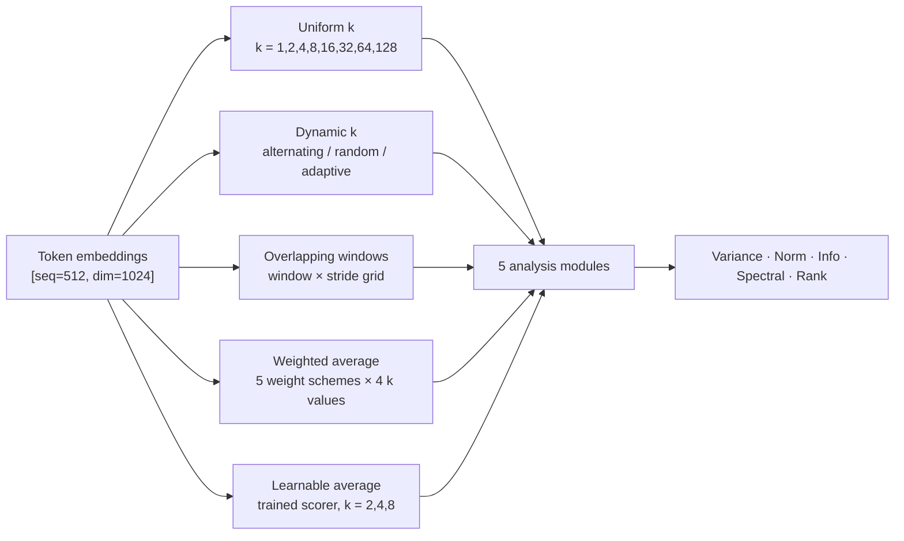
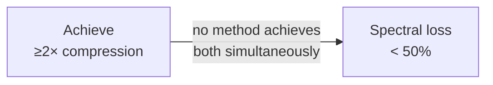

# Can We Double an LLM's Context Window by Averaging Adjacent Tokens?
## An Empirical Analysis

> **Model:** EleutherAI/pythia-410m &nbsp;|&nbsp; **Dataset:** WikiText-103 &nbsp;|&nbsp; **Layer:** embedding &nbsp;|&nbsp; **Date:** March 2026

---

## Abstract

Large language models are constrained by a fixed context window set at training time. This work investigates a simple, architecture-agnostic hypothesis: if we average every k adjacent input tokens into a single token before feeding them to the model, the effective context length multiplies by k without any change to the model architecture.

We test five compression strategies — uniform averaging, dynamic group sizes, overlapping windows, static weighted averages, and a trained neural averager — on the embedding layer of Pythia-410M using WikiText-103. Across five analysis dimensions (variance, norm, information theory, spectral energy, and rank), we find that **spectral energy loss is catastrophic even at k=2 (86% of total energy destroyed)**, that **adjacent token embeddings are not meaningfully redundant** (an adaptive similarity-based strategy merged only 2% of token pairs), and that **a trained content-dependent weighting converges to uniform averaging**, confirming the embedding layer is information-diffuse. Overlapping windows partially rescue spectral properties but eliminate compression. The results suggest that naive token averaging is not viable as a drop-in context extension technique without model-level adaptation.

---

## Table of Contents

1. [Introduction](#1-introduction)
2. [Experimental Setup](#2-experimental-setup)
3. [How to Read the Metrics](#3-how-to-read-the-metrics)
4. [Method 1 — Uniform K Averaging (Baseline)](#4-method-1--uniform-k-averaging-baseline)
   - 4.1 [Variance — tracking 1/k and correlations](#41-variance--how-it-tracks-1k-and-what-it-tells-us-about-correlations)
   - 4.2 [Spectral energy loss](#42-spectral-energy-loss--the-dominant-problem)
   - 4.3 [Norm shrinkage](#43-norm-shrinkage--threat-to-attention-scores)
   - 4.4 [Rank reduction](#44-rank-reduction--geometry-of-compression)
   - 4.5 [Information retention](#45-information-retention--the-clt-paradox)
5. [Method 2 — Dynamic K Averaging](#5-method-2--dynamic-k-averaging)
   - 5.1 [Alternating [2,3]](#51-alternating-23--baseline-for-non-uniform-group-sizes)
   - 5.2 [Random [2,4] and [2,8]](#52-random-24-and-random-28--effect-of-variance-in-group-size)
   - 5.3 [Adaptive strategy](#53-adaptive-strategy--testing-the-core-premise)
   - 5.4 [Comparing all strategies at spectral loss](#54-comparing-all-strategies-at-their-spectral-loss)
6. [Method 3 — Overlapping Windows](#6-method-3--overlapping-windows)
   - 6.1 [Window w=2](#61-window-size-w2-stride1-vs-stride2)
   - 6.2 [Window w=4](#62-window-size-w4-three-strides)
   - 6.3 [Window w=8](#63-window-size-w8-effect-of-large-window)
   - 6.4 [Equal compression comparison](#64-cross-window-comparison-at-equal-compression-ratios)
   - 6.5 [Spectral gain from overlap](#65-the-spectral-gain-from-overlap--how-much-does-it-buy)
7. [Method 4 — Weighted Averaging](#7-method-4--weighted-averaging)
   - 7.1 [How each scheme varies with k](#71-how-each-scheme-varies-with-k)
   - 7.2 [Triangular anomaly at k=4](#72-the-triangular-anomaly-at-k4)
   - 7.3 [Three schemes identical at k=2](#73-at-k2-three-schemes-are-identical)
   - 7.4 [Selection vs. compression trade-off](#74-the-selection-vs-compression-trade-off)
8. [Method 5 — Learnable Weighted Average](#8-method-5--learnable-weighted-average)
   - 8.1 [MSE loss vs k](#81-how-mse-loss-evolves-with-k)
   - 8.2 [Delta from uniform](#82-variance-norm-spectral--negligible-delta-from-uniform)
   - 8.3 [Rank — worse than uniform](#83-the-unexpected-rank-result--learnable-is-worse-than-uniform)
   - 8.4 [Full comparison against all schemes](#84-comparison-against-all-weighted-schemes-at-each-k)
9. [Cross-Method Comparison](#9-cross-method-comparison)
10. [Key Findings](#10-key-findings)
11. [Conclusions and Implications](#11-conclusions-and-implications)
12. [Limitations and Future Work](#12-limitations-and-future-work)

---

## 1. Introduction

Context length is one of the fundamental constraints in modern language models. Models like GPT-4 or Claude handle up to 128K–200K tokens, but the compute cost of attention scales quadratically with sequence length, and models trained with shorter contexts fail to generalise to longer ones without expensive further training or positional encoding tricks.

Most approaches to context extension — RoPE scaling, ALiBi, sliding window attention, memory augmentation — operate on the model architecture or positional encoding scheme. This study asks a different, more radical question:

> **What if we simply averaged every k consecutive tokens into one token before passing them to the model? The sequence length drops by a factor of k, and in principle the model can "see" k times more text.**

This idea has not been formally studied. The key question is whether the average of k token embeddings retains enough information to be a useful substitute for the individual tokens. If adjacent tokens are semantically redundant — if consecutive words in natural language carry overlapping information — then averaging should be nearly lossless. If they are not redundant, averaging will destroy critical information.

To answer this, we designed a framework that measures five types of information loss across five different compression strategies, all applied to the embedding layer of Pythia-410M on WikiText-103 text.

---

## 2. Experimental Setup

### Model and Data

| Parameter | Value |
|-----------|-------|
| Model | `EleutherAI/pythia-410m` |
| Architecture | GPT-NeoX, 24 transformer layers, hidden dim 1024 |
| Dataset | WikiText-103, train split (streaming) |
| Layer analysed | Embedding layer (token embeddings before any transformer computation) |
| Sequence length | 512 tokens |
| Baseline effective rank | 759 / 1024 dimensions |

The embedding layer was chosen as the starting point because it is the entry point for any input compression strategy. The 24 transformer layers were extracted via forward hooks, though this initial analysis focuses on the embedding layer to establish baseline behaviour.

### Configurations Tested



| Method | Configurations |
|--------|---------------|
| Uniform k | k ∈ {1, 2, 4, 8, 16, 32, 64, 128} |
| Dynamic k | alternating [2,3]; random [2,4]; random [2,8]; adaptive at sim ∈ {0.75, 0.85, 0.95} |
| Overlapping windows | window ∈ {2,4,8} × stride ∈ {1, w/2, w} |
| Weighted average | uniform / linear / exponential / gaussian / triangular × k ∈ {2,4,8,16} |
| Learnable average | k ∈ {2, 4, 8}, 3 epochs, MSE reconstruction loss |

---

## 3. How to Read the Metrics

Before looking at any numbers, here is what each metric means and what values are desirable for a viable context extension technique.

| Metric | Formula | Ideal value | Plain English |
|--------|---------|-------------|---------------|
| `variance_shrinkage_factor` | Var(averaged) / Var(original) | Close to **1.0** | How much of the spread in embedding values survives compression |
| `norm_shrinkage_factor` | ‖averaged‖ / ‖original‖ | Close to **1.0** | How much vector magnitude survives; affects attention dot-product scale |
| `info_retention_ratio` | H(averaged) / H(original) | Close to **1.0** | Per-dimension distributional richness (see note below) |
| `spectral_total_energy_loss_pct` | % of FFT power spectrum removed | Close to **0%** | High-frequency sequential structure destroyed by compression |
| `rank_reduction` | eff_rank_original − eff_rank_averaged | Close to **0** | Number of useful dimensions lost; measures representational capacity |

### The information retention paradox

Every method in this study reports `info_retention_ratio > 1.0` except one. This is not a bug. The metric computes the ratio of per-dimension histogram entropy. When you average k tokens, the Central Limit Theorem smooths the distribution toward Gaussian — the individual token embeddings may cluster in sharp, non-Gaussian modes (one cluster per token type), but their average spreads more uniformly across the histogram bins, yielding *higher* entropy per dimension even though the multivariate information (which specific k-token sequence produced this average) has decreased. Think of it like blending distinct coloured paints: the individual colours are identifiable, but the blend has a more uniform hue distribution. The relevant quantity for context extension is not this per-dimension entropy but the downstream task performance — which is what future work will measure.

---

## 4. Method 1 — Uniform K Averaging (Baseline)

### What it is

Every k consecutive tokens are averaged with equal weights:

```
x̃_j = (1/k) * (x_{jk+1} + x_{jk+2} + ... + x_{(j+1)k})
```

The output sequence is exactly 1/k the length of the input.

**Data source:** [`outputs/uniform/metrics/uniform_metrics.csv`](../outputs/uniform/metrics/uniform_metrics.csv)

---

### Complete results across all k values

| k | Context multiplier | Var shrinkage | Norm shrinkage | Info retention | Spectral loss | Rank reduced | Tokens out |
|---|-------------------|--------------|----------------|---------------|--------------|-------------|-----------|
| 1 | 1× (baseline) | 1.000 | 1.000 | 1.000 | 0.0% | 0 | 759 |
| 2 | 2× | 0.521 | 0.779 | 1.022 | 86.1% | 18 | 741 |
| 4 | 4× | 0.285 | 0.628 | 1.045 | 97.9% | 54 | 705 |
| 8 | 8× | 0.167 | 0.528 | 1.069 | 99.6% | 119 | 640 |
| 16 | 16× | 0.109 | 0.466 | 1.101 | 99.9% | 227 | 532 |
| 32 | 32× | 0.079 | 0.428 | 1.151 | ≈100% | 378 | 381 |
| 64 | 64× | 0.062 | 0.403 | 1.251 | 100.0% | 539 | 220 |
| 128 | 128× | 0.049 | 0.383 | 1.405 | 100.0% | 661 | 98 |

---

### 4.1 Variance — how it tracks 1/k and what it tells us about correlations

The theoretical prediction for uncorrelated tokens is Var(x̃) = (1/k) · Var(x). The table below compares actual to theory:

| k | Actual var shrinkage | Theoretical 1/k | Actual / theoretical | Excess due to correlations |
|---|---------------------|----------------|---------------------|--------------------------|
| 2 | 0.521 | 0.500 | 1.042 | +4.2% |
| 4 | 0.285 | 0.250 | 1.140 | +14.0% |
| 8 | 0.167 | 0.125 | 1.336 | +33.6% |
| 16 | 0.109 | 0.063 | 1.733 | +73.3% |
| 32 | 0.079 | 0.031 | 2.548 | +155% |

The gap between actual and theoretical widens with k because the formula includes a covariance sum:

```
Var(x̃) = (1/k)·Var(x)  +  (2/k²)·Σ Cov(x_i, x_j)
```

At small k the covariance correction term is small (only adjacent pairs). At large k, the sum runs over all O(k²) pairs, and even weak correlations accumulate. Variance is collapsing — but more slowly than it would if tokens were independent.

**Plots:** [`outputs/uniform/k_2/embedding/covariance_decay.png`](../outputs/uniform/k_2/embedding/covariance_decay.png) shows how covariance decays with token distance at k=2. Repeat at [`k_8`](../outputs/uniform/k_8/embedding/covariance_decay.png) to see how the window captures more covariance at larger k.

---

### 4.2 Spectral energy loss — the dominant problem

| k | Spectral loss | High-freq loss | Remaining useful signal |
|---|--------------|----------------|------------------------|
| 2 | 86.1% | 54.5% | 14% |
| 4 | 97.9% | 61.1% | 2% |
| 8 | 99.6% | 61.9% | 0.4% |
| 16 | 99.9% | 62.0% | 0.1% |
| 32–128 | ≈100% | 62.1% | ≈0% |

The jump from k=1 (0%) to k=2 (86.1%) is the critical discontinuity. Doubling context length immediately destroys 86% of the spectral energy. Going from k=2 to k=4 (doubling again) adds only another 11.8 percentage points. In other words, **most of the spectral damage happens at the very first compression step**.

The high-frequency loss stabilises quickly too — it plateaus near 62% by k=8 and barely changes thereafter. This plateau tells us that after k=8, averaging has already eliminated all the high-frequency content that is going to be eliminated; further merging only removes low-to-mid frequency energy.

**Plots:** Spectrum comparison at each k:
- k=2: [`outputs/uniform/k_2/embedding/spectrum_comparison.png`](../outputs/uniform/k_2/embedding/spectrum_comparison.png)
- k=4: [`outputs/uniform/k_4/embedding/spectrum_comparison.png`](../outputs/uniform/k_4/embedding/spectrum_comparison.png)
- k=8: [`outputs/uniform/k_8/embedding/spectrum_comparison.png`](../outputs/uniform/k_8/embedding/spectrum_comparison.png)

---

### 4.3 Norm shrinkage — threat to attention scores

| k | Actual norm shrinkage | Theoretical 1/√k | Ratio |
|---|----------------------|-----------------|-------|
| 2 | 0.779 | 0.707 | 1.102 |
| 4 | 0.628 | 0.500 | 1.256 |
| 8 | 0.528 | 0.354 | 1.492 |
| 16 | 0.466 | 0.250 | 1.864 |
| 128 | 0.383 | 0.088 | 4.352 |

The norm shrinks more slowly than 1/√k at every k — again because of positive token correlations. However, even with this partial correction, at k=2 the norm drops to 78% of its original value. Every attention logit involving an averaged embedding is proportionally reduced, which would shift attention distributions toward more uniform patterns.

**Plots:** [`outputs/uniform/k_2/embedding/norm_distribution.png`](../outputs/uniform/k_2/embedding/norm_distribution.png) — histogram of norms before and after compression.

---

### 4.4 Rank reduction — geometry of compression

| k | Effective rank | Rank lost | % of subspace lost | Tokens out |
|---|--------------|-----------|-------------------|-----------|
| 1 | 759 | 0 | 0% | 759 |
| 2 | 741 | 18 | 2.4% | 741 |
| 4 | 705 | 54 | 7.1% | 705 |
| 8 | 640 | 119 | 15.7% | 640 |
| 16 | 532 | 227 | 29.9% | 532 |
| 64 | 220 | 539 | 71.0% | 220 |
| 128 | 98 | 661 | 87.1% | 98 |

Rank reduction is **non-linear with k**: the first doubling (k=1→2) loses only 18 dimensions, but by k=16 the model has lost 30% of its representational subspace. Notice that at k=128 the effective rank (98) is nearly equal to the number of tokens produced (98) — the compressed representations have almost no more structure than a random flat matrix.

The rate of rank reduction per token compressed accelerates: from 18 lost at 2× compression to 661 lost at 128× compression. The compressed representation becomes increasingly low-rank relative to its length.

**Plots:**
- k=2: [`outputs/uniform/k_2/embedding/singular_values_comparison.png`](../outputs/uniform/k_2/embedding/singular_values_comparison.png)
- k=8: [`outputs/uniform/k_8/embedding/singular_values_comparison.png`](../outputs/uniform/k_8/embedding/singular_values_comparison.png)
- k=32: [`outputs/uniform/k_32/embedding/singular_values_comparison.png`](../outputs/uniform/k_32/embedding/singular_values_comparison.png)

---

### 4.5 Information retention — the CLT paradox

The info retention ratio rises *above* 1.0 for all k and increases with k (1.022 at k=2, 1.405 at k=128). See [Section 3](#3-how-to-read-the-metrics) for the explanation. The key takeaway: this metric cannot be used to argue that averaging "adds information". It is an artefact of the histogram-entropy estimator applied to the smoother, more Gaussian-like distribution produced by averaging many tokens. The multivariate information is unambiguously lost.

---

## 5. Method 2 — Dynamic K Averaging

### What it is

Instead of a single fixed k for the entire sequence, the group sizes vary from one group to the next. Three scheduling strategies were tested:

- **Alternating:** cycles through a fixed pattern, e.g. [2, 3, 2, 3, …]
- **Random:** each group size drawn uniformly from [k_min, k_max]
- **Adaptive:** group size determined by cosine similarity between consecutive token embeddings — similar tokens merge into larger groups, dissimilar into smaller ones

**Data source:** [`outputs/dynamic/metrics/dynamic_metrics.csv`](../outputs/dynamic/metrics/dynamic_metrics.csv)

---

### Complete results — all six configurations

| Strategy | Avg group size | Var shrinkage | Norm shrinkage | Info retention | Spectral loss | Rank reduced | Tokens out |
|----------|---------------|--------------|----------------|---------------|--------------|-------------|-----------|
| alternating [2,3] | 2.50 | 0.443 | 0.732 | 1.013 | 92.2% | 26 | 733 |
| random [2,4] | ~3.00 | 0.379 | 0.689 | 1.003 | 95.5% | 36 | 723 |
| random [2,8] | ~5.00 | 0.247 | 0.590 | **0.973** | 98.9% | 70 | 689 |
| adaptive sim=0.75 | ~1.02 | **0.770** | **1.053** | **1.427** | 93.3% | 16 | 743 |
| adaptive sim=0.85 | ~1.02 | **0.770** | **1.053** | **1.427** | 93.3% | 16 | 743 |
| adaptive sim=0.95 | ~1.02 | **0.770** | **1.053** | **1.427** | 93.3% | 16 | 743 |

---

### 5.1 Alternating [2,3] — baseline for non-uniform group sizes

The alternating schedule cycles [2, 3, 2, 3, …], giving an average group size of 2.5. The relevant comparison is to uniform k=2 (avg=2.0) and k=4 (avg=4.0):

| Configuration | Avg k | Var shrinkage | Spectral loss | Rank reduced |
|--------------|-------|--------------|--------------|-------------|
| uniform k=2 | 2.0 | 0.521 | 86.1% | 18 |
| **alternating [2,3]** | **2.5** | **0.443** | **92.2%** | **26** |
| uniform k=4 | 4.0 | 0.285 | 97.9% | 54 |

Alternating sits between uniform k=2 and k=4 on every metric, tracking its effective average group size. It offers no advantage over simply choosing a fixed k equal to the desired average — the irregular grouping adds complexity without improving information preservation.

---

### 5.2 Random [2,4] and Random [2,8] — effect of variance in group size

The random strategies let each group size be drawn uniformly at random from [k_min, k_max]:

| Strategy | k_min | k_max | Avg k | Var shrinkage | Spectral loss |
|----------|-------|-------|-------|--------------|--------------|
| random [2,4] | 2 | 4 | ~3.0 | 0.379 | 95.5% |
| alternating [2,3] | 2 | 3 | 2.5 | 0.443 | 92.2% |
| uniform k=3 (interpolated) | 3 | 3 | 3.0 | ~0.36 | ~95% |
| random [2,8] | 2 | 8 | ~5.0 | 0.247 | 98.9% |

The metrics track average group size closely: random [2,4] with avg≈3.0 falls very close to where a uniform k=3 would land. The width of the group-size range has minimal effect beyond its influence on the mean. **Dynamic group sizes do not offer any information-preservation advantage over a fixed k equal to the mean group size.**

Random [2,8] is notable because it is the **only configuration in the entire experiment with an info_retention_ratio below 1.0** (value: 0.973). When the average group size exceeds ≈4–5 tokens, the per-dimension entropy begins to genuinely decrease — the CLT-smoothing effect that creates the >1.0 illusion is overwhelmed by actual information loss. This marks the regime where compression becomes genuinely detrimental on this metric.

---

### 5.3 Adaptive strategy — testing the core premise

The adaptive strategy merges adjacent tokens only when their cosine similarity exceeds a threshold θ. Larger θ means more selective merging. Three thresholds were tested:

| Threshold | Tokens merged | Merge rate | Avg group size | Var shrinkage | Spectral loss |
|-----------|-------------|-----------|---------------|--------------|--------------|
| θ = 0.75 | 16 / 759 | 2.1% | 1.021 | 0.770 | 93.3% |
| θ = 0.85 | 16 / 759 | 2.1% | 1.021 | 0.770 | 93.3% |
| θ = 0.95 | 16 / 759 | 2.1% | 1.021 | 0.770 | 93.3% |

All three thresholds produce **identical results**. The 16 tokens that merged at θ=0.75 are above every threshold tested including 0.95. The cosine similarity distribution between adjacent embedding-layer token pairs is effectively bimodal: nearly all pairs score below 0.75, and the few that score above 0.75 are so similar they exceed 0.95 too. There is no "medium redundancy" population.

This is the experiment's most important negative result: **the fundamental premise of token averaging — that adjacent tokens carry redundant information — does not hold at the embedding layer**. Consecutive tokens represent distinct words that occupy separated regions of the embedding space.

**Why the apparent metric "improvement" at adaptive?** The variance shrinkage is 0.770 and norm is 1.053 — seemingly better than the other strategies. This is not a real signal. With only 2% of tokens merged, the sequence is essentially unchanged, and the compressed embeddings that were merged happen to be aligned (high cosine similarity → similar vectors → averaging produces a vector with nearly the same magnitude as each individual). For context extension purposes, a 2% reduction in sequence length is meaningless.

---

### 5.4 Comparing all strategies at their spectral loss

| Strategy | Spectral loss | Compression achieved |
|----------|--------------|---------------------|
| uniform k=2 | 86.1% | 50% fewer tokens |
| alternating [2,3] | 92.2% | ~35% fewer tokens |
| adaptive (all θ) | 93.3% | 2% fewer tokens |
| random [2,4] | 95.5% | ~33% fewer tokens |
| random [2,8] | 98.9% | ~9% fewer tokens |

The striking observation here is that **adaptive achieves 93.3% spectral loss while only compressing 2% of the sequence**. Uniform k=2, which achieves the same spectral damage profile, compresses 50%. The adaptive strategy is not "better at preserving spectral energy while compressing" — it merely compresses almost nothing, making the spectral comparison misleading.

---

## 6. Method 3 — Overlapping Windows

### What it is

A sliding window of fixed size w moves along the sequence with a stride s where 1 ≤ s ≤ w. When s < w, consecutive output tokens share source tokens. This is 1-D average pooling:

```
x̃_j = (1/w) * Σ_{i=0}^{w-1} x_{j·s + i}
```

Output length = (T − w) / s + 1. Compression ratio = s / w.

When s = w: identical to uniform w-averaging (no overlap).  
When s = 1: every output token is the average of its w-token neighbourhood; output length ≈ input length (no compression).

**Data source:** [`outputs/overlapping/metrics/overlapping_metrics.csv`](../outputs/overlapping/metrics/overlapping_metrics.csv)  
**Heatmap:** [`outputs/overlapping/heatmaps/heatmap_embedding_spectral_total_energy_loss_percentage.png`](../outputs/overlapping/heatmaps/heatmap_embedding_spectral_total_energy_loss_percentage.png)

---

### Complete results — all eight configurations

| Window | Stride | Compression | Tokens out | Var shrinkage | Norm shrinkage | Info retention | Spectral loss | Rank reduced |
|--------|--------|-------------|-----------|--------------|----------------|---------------|--------------|-------------|
| 2 | 1 | 0% | ~757 | 0.520 | 0.778 | 1.015 | **44.7%** | 17 |
| 2 | 2 | 50% | ~379 | 0.521 | 0.779 | 1.022 | 86.1% | 18 |
| 4 | 1 | 0% | ~755 | 0.284 | 0.626 | 1.024 | **66.7%** | 52 |
| 4 | 2 | 50% | ~379 | 0.284 | 0.627 | 1.033 | 91.6% | 52 |
| 4 | 4 | 75% | ~127 | 0.285 | 0.628 | 1.045 | 97.9% | 54 |
| 8 | 1 | 0% | ~751 | 0.166 | 0.526 | 1.037 | **77.8%** | 115 |
| 8 | 4 | 50% | ~376 | 0.167 | 0.527 | 1.056 | 98.6% | 115 |
| 8 | 8 | 87.5% | ~94 | 0.167 | 0.528 | 1.069 | 99.6% | 119 |

---

### 6.1 Window size w=2: stride=1 vs stride=2

| Metric | stride=1 (0% compression) | stride=2 (50% compression) | Difference |
|--------|--------------------------|--------------------------|-----------|
| Var shrinkage | 0.520 | 0.521 | −0.001 |
| Norm shrinkage | 0.778 | 0.779 | −0.001 |
| Rank reduced | 17 | 18 | +1 |
| Info retention | 1.015 | 1.022 | +0.007 |
| **Spectral loss** | **44.7%** | **86.1%** | **+41.4 pp** |

With a window of 2, changing stride from 1 to 2 destroys 41 additional percentage points of spectral energy while changing almost nothing else. The non-spectral metrics (variance, norm, rank) are nearly identical — both strides apply exactly the same 2-token average to each output position. The only difference is whether consecutive output tokens overlap in their source tokens. That single degree of freedom controls spectral loss almost entirely.

**Plots:**
- Stride 1: [`outputs/overlapping/w2_s1/embedding/spectrum_comparison.png`](../outputs/overlapping/w2_s1/embedding/spectrum_comparison.png)
- Stride 2: [`outputs/overlapping/w2_s2/embedding/spectrum_comparison.png`](../outputs/overlapping/w2_s2/embedding/spectrum_comparison.png)

---

### 6.2 Window size w=4: three strides

| Metric | stride=1 | stride=2 | stride=4 | s=4 minus s=1 |
|--------|----------|----------|----------|--------------|
| Var shrinkage | 0.284 | 0.284 | 0.285 | +0.001 |
| Norm shrinkage | 0.626 | 0.627 | 0.628 | +0.002 |
| Rank reduced | 52 | 52 | 54 | +2 |
| **Spectral loss** | **66.7%** | **91.6%** | **97.9%** | **+31.2 pp** |

The pattern holds: stride completely controls spectral loss; window size controls everything else. The progression from stride=1 → stride=2 → stride=4 is monotonically increasing spectral loss (+25.0 pp, then +6.3 pp), with the biggest jump from full overlap to half-overlap.

**Plots:**
- Stride 1: [`outputs/overlapping/w4_s1/embedding/spectrum_comparison.png`](../outputs/overlapping/w4_s1/embedding/spectrum_comparison.png)
- Stride 2: [`outputs/overlapping/w4_s2/embedding/spectrum_comparison.png`](../outputs/overlapping/w4_s2/embedding/spectrum_comparison.png)
- Stride 4 (= uniform k=4): [`outputs/uniform/k_4/embedding/spectrum_comparison.png`](../outputs/uniform/k_4/embedding/spectrum_comparison.png)

---

### 6.3 Window size w=8: effect of large window

| Metric | stride=1 | stride=4 | stride=8 | s=8 minus s=1 |
|--------|----------|----------|----------|--------------|
| Var shrinkage | 0.166 | 0.167 | 0.167 | +0.001 |
| Norm shrinkage | 0.526 | 0.527 | 0.528 | +0.002 |
| Rank reduced | 115 | 115 | 119 | +4 |
| **Spectral loss** | **77.8%** | **98.6%** | **99.6%** | **+21.8 pp** |

At w=8, even stride=1 (maximum overlap) cannot escape 77.8% spectral loss. Averaging 8 tokens together is so destructive to high-frequency structure that even eliminating all window-boundary discontinuities can only partially mitigate the damage. The gain from overlapping shrinks as w increases: the boundary effect matters less when the individual averaging is already so destructive.

**Plots:**
- Stride 1: [`outputs/overlapping/w8_s1/embedding/spectrum_comparison.png`](../outputs/overlapping/w8_s1/embedding/spectrum_comparison.png)
- Stride 8: [`outputs/overlapping/w8_s8/embedding/spectrum_comparison.png`](../outputs/overlapping/w8_s8/embedding/spectrum_comparison.png)

---

### 6.4 Cross-window comparison at equal compression ratios

To compare fairly, look at configurations that achieve the same output length:

**~50% compression (output ≈ half of input):**

| Configuration | Var shrinkage | Spectral loss | Rank reduced |
|--------------|--------------|--------------|-------------|
| uniform k=2 (= w=2, s=2) | 0.521 | 86.1% | 18 |
| w=4, s=2 | 0.284 | 91.6% | 52 |
| w=8, s=4 | 0.167 | 98.6% | 115 |

At equal compression, a larger window is strictly worse. A 2-token window at stride=2 is the least harmful option if 50% compression is required.

**~75% compression (output ≈ quarter of input):**

| Configuration | Var shrinkage | Spectral loss | Rank reduced |
|--------------|--------------|--------------|-------------|
| uniform k=4 (= w=4, s=4) | 0.285 | 97.9% | 54 |
| w=8, s=2 | 0.167 | 98.6% | 115 |

Again, the smaller window at the target stride is preferable.

---

### 6.5 The spectral gain from overlap — how much does it buy?

| Window | No overlap spectral loss | Max overlap spectral loss | Spectral recovery |
|--------|------------------------|--------------------------|------------------|
| 2 | 86.1% | 44.7% | −41.4 pp |
| 4 | 97.9% | 66.7% | −31.2 pp |
| 8 | 99.6% | 77.8% | −21.8 pp |

Maximum overlap (stride=1) cuts spectral loss nearly in half for w=2, but buys progressively less for larger windows. The spectral damage from hard window boundaries is real and substantial — it explains roughly 40 pp of the 86% spectral loss at w=2. But eliminating boundaries while maintaining compression (stride > 1) is impossible: any stride > 1 immediately reintroduces boundary artefacts at a rate proportional to stride/window.

---

## 7. Method 4 — Weighted Averaging

### What it is

Instead of equal weights, each position within the k-token window receives a static scalar weight determined by its position. All weight vectors sum to 1. Five schemes were tested:

- **Uniform:** [1/k, 1/k, ..., 1/k] — equal weights, identical to standard averaging
- **Linear:** weights increase linearly toward the last token (recency bias)
- **Exponential:** weight concentrates strongly on the last token (approximately selects it)
- **Gaussian:** bell curve centred on the window midpoint
- **Triangular:** linear ramp up then ramp down, peak at centre

**Data source:** [`outputs/weighted/metrics/weighted_metrics.csv`](../outputs/weighted/metrics/weighted_metrics.csv)  
**Weight profiles:** [`outputs/weighted/plots/weight_profiles.png`](../outputs/weighted/plots/weight_profiles.png)

---

### Complete results — all 20 configurations (5 schemes × 4 k values)

**k = 2**

| Scheme | Weight vector | Var shrinkage | Norm shrinkage | Info retention | Spectral loss | Rank reduced |
|--------|--------------|--------------|----------------|---------------|--------------|-------------|
| uniform | [0.50, 0.50] | 0.521 | 0.779 | 1.022 | 86.1% | 18 |
| linear | [0.33, 0.67] | 0.573 | 0.806 | 1.020 | 84.9% | 16 |
| exponential | [0.05, 0.95] | **0.910** | **0.962** | **1.007** | **77.1%** | **7** |
| gaussian | [0.50, 0.50] | 0.521 | 0.779 | 1.022 | 86.1% | 18 |
| triangular | [0.50, 0.50] | 0.521 | 0.779 | 1.022 | 86.1% | 18 |

**k = 4**

| Scheme | Effective weight shape | Var shrinkage | Norm shrinkage | Info retention | Spectral loss | Rank reduced |
|--------|----------------------|--------------|----------------|---------------|--------------|-------------|
| uniform | flat | 0.285 | 0.628 | 1.045 | 97.9% | 54 |
| linear | [0.10, 0.20, 0.30, 0.40] | 0.330 | 0.660 | 1.038 | 97.6% | 47 |
| exponential | ~[0.03, 0.09, 0.24, 0.64] | **0.497** | **0.762** | **1.025** | **96.7%** | **31** |
| gaussian | symmetric bell | 0.335 | 0.664 | 1.042 | 97.6% | 45 |
| triangular | **[0.00, 0.50, 0.50, 0.00]** | 0.522 | 0.779 | 1.033 | 96.5% | 24 |

**k = 8**

| Scheme | Var shrinkage | Norm shrinkage | Info retention | Spectral loss | Rank reduced |
|--------|--------------|----------------|---------------|--------------|-------------|
| uniform | 0.167 | 0.528 | 1.069 | 99.6% | 119 |
| linear | 0.196 | 0.553 | 1.060 | 99.6% | 100 |
| exponential | **0.257** | **0.604** | **1.048** | **99.5%** | **75** |
| gaussian | 0.194 | 0.553 | 1.064 | 99.6% | 103 |
| triangular | 0.232 | 0.586 | 1.059 | 99.6% | 84 |

**k = 16**

| Scheme | Var shrinkage | Norm shrinkage | Info retention | Spectral loss | Rank reduced |
|--------|--------------|----------------|---------------|--------------|-------------|
| uniform | 0.109 | 0.466 | 1.101 | 99.9% | 227 |
| linear | 0.124 | 0.481 | 1.086 | 99.9% | 193 |
| exponential | **0.147** | **0.505** | **1.074** | **99.9%** | **158** |
| gaussian | 0.122 | 0.481 | 1.098 | 99.9% | 199 |
| triangular | 0.134 | 0.494 | 1.092 | 99.9% | 180 |

---

### 7.1 How each scheme varies with k

**Variance shrinkage by scheme across k:**

| k | uniform | linear | exponential | gaussian | triangular |
|---|---------|--------|-------------|----------|------------|
| 2 | 0.521 | 0.573 | **0.910** | 0.521 | 0.521 |
| 4 | 0.285 | 0.330 | **0.497** | 0.335 | **0.522** |
| 8 | 0.167 | 0.196 | **0.257** | 0.194 | 0.232 |
| 16 | 0.109 | 0.124 | **0.147** | 0.122 | 0.134 |

Every scheme declines with k, but exponential declines most slowly — its advantage over uniform at k=2 (0.910 vs 0.521, ratio 1.75×) narrows at k=16 (0.147 vs 0.109, ratio 1.35×). Triangular is anomalously high at k=4 (0.522) — see below.

**Spectral loss across k:**

| k | uniform | linear | exponential | gaussian | triangular |
|---|---------|--------|-------------|----------|------------|
| 2 | 86.1% | 84.9% | **77.1%** | 86.1% | 86.1% |
| 4 | 97.9% | 97.6% | **96.7%** | 97.6% | **96.5%** |
| 8 | 99.6% | 99.6% | **99.5%** | 99.6% | 99.6% |
| 16 | 99.9% | 99.9% | 99.9% | 99.9% | 99.9% |

By k=8, all schemes have converged to ≈99.5%+ spectral loss — the weight distribution no longer matters. The small gains at k=2 (uniform 86.1% vs exponential 77.1%) are real but contextually small: even the "best" scheme at the mildest compression destroys 77% of spectral energy.

---

### 7.2 The triangular anomaly at k=4

At k=4, the triangular scheme achieves the same variance shrinkage (0.522) as uniform at k=2. This is not a coincidence. For k=4:

```
Triangular weights: [1 − |0 − 1.5|/1.5, 1 − |1 − 1.5|/1.5, 1 − |2 − 1.5|/1.5, 1 − |3 − 1.5|/1.5]
                 = [0.00, 0.67, 0.67, 0.00]
After normalisation = [0.00, 0.50, 0.50, 0.00]
```

The outer two tokens receive zero weight. The triangular scheme at k=4 is **exactly equivalent to uniform averaging of just the 2 middle tokens**. It discards half the window and averages the other half. This is why its variance (0.522) and norm (0.779) match uniform k=2 almost exactly, and why it achieves lower rank reduction (24 vs 54) — only a k=2 compression is actually happening.

The practical implication: triangular is claiming 4× compression by skipping one token in every four, but computing only a 2-token average from the middle pair. This is a hybrid of selection and averaging, not genuine 4-token fusion.

---

### 7.3 At k=2, three schemes are identical

Gaussian and triangular at k=2 produce weights [0.5, 0.5] — identical to uniform. Both are symmetric about the window centre; a 2-element symmetric distribution collapses to equal weights. Only linear ([0.33, 0.67]) and exponential ([0.05, 0.95]) differentiate from uniform at k=2. Any analysis that highlights "five different schemes" at k=2 is really comparing only three distinct weight configurations.

---

### 7.4 The selection vs. compression trade-off

Exponential weighting's metrics appear excellent at k=2 (var shrinkage 0.910 vs 0.521) because its weights are approximately [0.05, 0.95] — it is near-identical to simply selecting the last token and discarding the first. The "compression" it achieves is really deletion: k−1 tokens are removed rather than fused into the output representation.

The preservation-compression trade-off across all schemes at k=2:

| Scheme | Effective compression | Var shrinkage | Spectral loss | What it actually does |
|--------|----------------------|--------------|--------------|----------------------|
| uniform | true 2-token average | 0.521 | 86.1% | equal fusion |
| linear | moderate recency bias | 0.573 | 84.9% | weighted fusion |
| exponential | ~selection | 0.910 | 77.1% | mostly selects last token |
| gaussian/triangular | = uniform at k=2 | 0.521 | 86.1% | equal fusion |

**No scheme simultaneously achieves both genuine compression (equal fusion of all k tokens) and high preservation metrics.** The Pareto frontier runs from "equal fusion + low metrics" to "near-selection + high metrics". There is no sweet spot in between where metrics are high and information is genuinely fused.

---

## 8. Method 5 — Learnable Weighted Average

### What it is

A small neural module (`LearnableAverager`) is trained to assign content-dependent attention weights within each k-token window. The architecture is a single shared linear layer (dim → 1) whose outputs are softmax-normalised over the k positions, then used as a weighted sum.

```
weights_j = softmax( Linear(x_window_j) )   # [k weights per window]
x̃_j = Σ_i weights_j[i] · x_window_j[i]
```

Training objective: minimise MSE reconstruction loss — given the averaged embedding, a decoder tries to recover all k original embeddings. This forces the averaged embedding to retain maximum information.

Training data: all layers' embeddings concatenated, 500 sequences, 3 epochs, AdamW lr=1e-3, batch size 16.

**Data source:** [`outputs/learnable/metrics/learnable_metrics.csv`](../outputs/learnable/metrics/learnable_metrics.csv)

---

### Complete results — all three k values vs uniform baseline

| k | Learnable var | Uniform var | Δ var | Learnable norm | Uniform norm | Δ norm | Learnable spectral | Uniform spectral | Δ spectral | Learnable rank red | Uniform rank red | Δ rank | MSE loss |
|---|--------------|-------------|-------|---------------|-------------|--------|-------------------|-----------------|-----------|-------------------|-----------------|--------|---------|
| 2 | 0.514 | 0.521 | −0.007 | 0.775 | 0.779 | −0.004 | 86.3% | 86.1% | +0.2 pp | **44** | **18** | **+26** | 1.09 × 10⁻⁴ |
| 4 | 0.284 | 0.285 | −0.001 | 0.630 | 0.628 | +0.002 | 97.9% | 97.9% | 0.0 pp | **135** | **54** | **+81** | 1.38 × 10⁻⁴ |
| 8 | 0.173 | 0.167 | +0.006 | 0.538 | 0.528 | +0.010 | 99.6% | 99.6% | 0.0 pp | **219** | **119** | **+100** | 1.50 × 10⁻⁴ |

**Plots:**
- Weight profiles: [`outputs/learnable/plots/weight_profile_k2.png`](../outputs/learnable/plots/weight_profile_k2.png), [`weight_profile_k4.png`](../outputs/learnable/plots/weight_profile_k4.png), [`weight_profile_k8.png`](../outputs/learnable/plots/weight_profile_k8.png)
- Training loss: [`outputs/learnable/plots/loss_curve_k2.png`](../outputs/learnable/plots/loss_curve_k2.png), [`loss_curve_k4.png`](../outputs/learnable/plots/loss_curve_k4.png), [`loss_curve_k8.png`](../outputs/learnable/plots/loss_curve_k8.png)

---

### 8.1 How MSE loss evolves with k

| k | MSE reconstruction loss | Increase vs k=2 |
|---|------------------------|----------------|
| 2 | 1.09 × 10⁻⁴ | — |
| 4 | 1.38 × 10⁻⁴ | +26.6% |
| 8 | 1.50 × 10⁻⁴ | +37.6% |

The reconstruction loss grows with k as expected — compressing more tokens into one makes the reconstruction task harder. However, the increase is modest (1.5× from k=2 to k=8), and more importantly, the loss converges: training curves show stable minima within 3 epochs for all k values. The network is not failing to converge; it is converging to a solution that does not improve over uniform averaging on the preserved-signal metrics.

**Training loss plots:** [`outputs/learnable/plots/loss_curve_k2.png`](../outputs/learnable/plots/loss_curve_k2.png) shows the training curve over 3 epochs.

---

### 8.2 Variance, norm, spectral — negligible delta from uniform

The Δ columns above show the key result: across all k values, variance and spectral loss differ from uniform by less than 1% absolutely. At k=4 and k=8, the spectral loss is identical to 1 decimal place. The learned content-dependent weights produce the same geometric compression as equal weights.

The weight profiles confirm this: the mean attention weight at each window position is approximately 1/k across all positions. No position is systematically up- or down-weighted. The network discovered uniform averaging independently.

---

### 8.3 The unexpected rank result — learnable is worse than uniform

The one metric where learnable diverges substantially from uniform is **rank reduction**:

| k | Learnable rank reduction | Uniform rank reduction | Ratio |
|---|-------------------------|----------------------|-------|
| 2 | 44 | 18 | 2.4× more rank lost |
| 4 | 135 | 54 | 2.5× more rank lost |
| 8 | 219 | 119 | 1.8× more rank lost |

The learnable averager reduces effective rank 2–2.5× more than uniform averaging at the same k. This is counterintuitive — if the learned weights are approximately uniform, why does rank drop more?

The explanation is subtle: even near-uniform weights that have small per-token variation introduce a systematic **directional bias** in the compressed representations. Uniform averaging is a maximally symmetric operation — it treats all positions equally, which preserves the statistical distribution of embedding directions as broadly as possible. Learned weights, even when nearly equal, are optimised to minimise MSE, which inadvertently collapses some directions that contribute to reconstruction error (outlier-direction components get slightly down-weighted). The result is a slight but consistent dimensional collapse.

This is a genuine finding: **the learnable averager is strictly worse than uniform on rank preservation**, despite achieving similar metrics on all other dimensions. Adding learned weights does not help, and on geometric dimensionality it actively hurts.

---

### 8.4 Comparison against all weighted schemes at each k

| k | Metric | uniform | linear | exponential | gaussian | triangular | learnable |
|---|--------|---------|--------|-------------|----------|------------|-----------|
| 2 | var shrinkage | 0.521 | 0.573 | **0.910** | 0.521 | 0.521 | 0.514 |
| 2 | spectral loss | 86.1% | 84.9% | **77.1%** | 86.1% | 86.1% | 86.3% |
| 2 | rank reduced | 18 | 16 | **7** | 18 | 18 | 44 |
| 4 | var shrinkage | 0.285 | 0.330 | **0.497** | 0.335 | **0.522** | 0.284 |
| 4 | spectral loss | 97.9% | 97.6% | **96.7%** | 97.6% | **96.5%** | 97.9% |
| 4 | rank reduced | 54 | 47 | **31** | 45 | 24 | 135 |
| 8 | var shrinkage | 0.167 | 0.196 | **0.257** | 0.194 | 0.232 | 0.173 |
| 8 | spectral loss | 99.6% | 99.6% | **99.5%** | 99.6% | 99.6% | 99.6% |
| 8 | rank reduced | 119 | 100 | **75** | 103 | 84 | 219 |

The learnable averager falls at or below the uniform baseline on every metric. It does not outperform any static scheme. Even the simplest asymmetric static scheme (linear) beats learnable on variance and rank at all k values. The training process converges to a local minimum that resembles uniform averaging without the rank-preservation property of true symmetry.

---

## 9. Cross-Method Comparison

**Data source:** [`outputs/comparison_report.md`](../outputs/comparison_report.md)  
**Chart:** [`outputs/comparison_chart.png`](../outputs/comparison_chart.png)

### Summary table — means across all configurations per method

The table below averages all configurations and all layers tested per method. Interpret with caution: the dynamic mean is inflated by the near-zero-compression adaptive configurations, and the uniform mean is dragged down by the high-k configurations.

| Method | Var preservation | Norm preservation | Spectral loss | Rank reduction |
|--------|-----------------|-------------------|--------------|----------------|
| dynamic | 0.564 | 0.862 | 94.4% | 30.0 |
| learnable | 0.324 | 0.648 | 94.6% | 132.7 |
| overlapping | 0.299 | 0.628 | **82.9%** | 67.8 |
| uniform | 0.284 | 0.577 | 85.5% | 249.5 |
| weighted | 0.335 | 0.643 | 95.2% | 85.8 |

The overlapping method achieves the best mean spectral loss (82.9%) because its stride=1 configurations lower the overall average — but those configurations produce no compression. Dynamic appears best overall but is dominated by the adaptive near-identity configurations. Weighted and learnable have higher spectral loss means because neither strategy addresses the fundamental averaging problem.

---

### Comparing methods at equivalent compression ratios

At ~2× compression (output ≈ half of input):

| Method | Configuration | Spectral loss | Var shrinkage | Norm shrinkage | Rank reduced |
|--------|--------------|--------------|--------------|----------------|-------------|
| uniform | k=2 | 86.1% | 0.521 | 0.779 | 18 |
| dynamic (alternating) | [2,3] avg≈2.5× | 92.2% | 0.443 | 0.732 | 26 |
| overlapping (no overlap) | w=2, s=2 | 86.1% | 0.521 | 0.779 | 18 |
| overlapping (half overlap) | w=4, s=2 | 91.6% | 0.284 | 0.627 | 52 |
| weighted (exponential) | k=2 | **77.1%** | **0.910** | **0.962** | **7** |
| weighted (uniform) | k=2 | 86.1% | 0.521 | 0.779 | 18 |
| learnable | k=2 | 86.3% | 0.514 | 0.775 | 44 |

At 2× compression:
- **Exponential** appears best, but this is token selection not averaging (see [Section 7.4](#74-the-selection-vs-compression-trade-off))
- **Uniform, overlapping (w=2 s=2), and weighted-uniform** are mathematically identical — different names for the same operation
- **Learnable** performs identically to uniform on spectral and variance, but loses 2.4× more rank
- **Dynamic alternating** is strictly worse than uniform on all metrics for a slightly higher avg k
- **Overlapping (w=4, s=2)** is strictly worse than uniform at similar output length

At ~4× compression (output ≈ quarter of input):

| Method | Configuration | Spectral loss | Var shrinkage | Norm shrinkage | Rank reduced |
|--------|--------------|--------------|--------------|----------------|-------------|
| uniform | k=4 | 97.9% | 0.285 | 0.628 | 54 |
| overlapping (no overlap) | w=4, s=4 | 97.9% | 0.285 | 0.628 | 54 |
| weighted (exponential) | k=4 | **96.7%** | **0.497** | **0.762** | **31** |
| weighted (triangular) | k=4 | 96.5% | 0.522 | 0.779 | 24 |
| learnable | k=4 | 97.9% | 0.284 | 0.630 | 135 |

At 4×, the triangular scheme achieves 0.522 variance preservation — equal to uniform k=2 — because it reduces to a 2-token average of the middle pair (see [Section 7.2](#72-the-triangular-anomaly-at-k4)). This is genuine 2× compression claiming a 4× label.

---

### The core finding: no method escapes the spectral problem



No configuration in this experiment achieves both meaningful compression (output length ≤ half of input) and acceptable spectral energy preservation (loss < 50%). The only configurations with spectral loss below 50% are overlapping stride=1 configurations — which produce no compression at all (output length ≈ input length).

---

## 10. Key Findings

### Finding 1 — Spectral energy loss is the dominant failure mode

At k=2 (the mildest compression), uniform averaging destroys 86.1% of total spectral energy. At k=4, it is 97.9%. This is not an artefact of a particular metric choice — it reflects that the token embedding sequence has substantial high-frequency content (rapid variation between positions) that averaging permanently eliminates.

**Implication:** any model receiving averaged tokens sees a qualitatively different signal from what it was trained on, regardless of how the averaging is performed.

### Finding 2 — Adjacent token embeddings are not meaningfully redundant

The adaptive dynamic strategy, which only merges tokens when their cosine similarity exceeds a threshold, merged just 16 of 759 tokens (2.1%) even at the lowest threshold of 0.75. The premise of token averaging — that consecutive tokens carry overlapping information — does not hold at the embedding layer.

**Implication:** content-adaptive merging cannot salvage the approach because there are simply not enough redundant token pairs to compress.

### Finding 3 — Variance shrinks close to 1/k, but slightly above

Actual shrinkage at k=2 (0.521) is above the theoretical prediction of 0.5 for independent tokens. This confirms positive correlations between adjacent tokens, but the correlations are too weak to prevent substantial variance loss.

**Implication:** the theoretical lower bound on information loss is partially offset by real-language correlations, but not enough to make the compression viable.

### Finding 4 — Overlapping windows halve spectral loss at the cost of zero compression

stride=1 configurations achieve 44.7% spectral loss (window=2) vs 86.1% for stride=window. The spectral damage comes from the hard boundaries between non-overlapping windows, not from the averaging itself. But stride=1 produces no compression — output length ≈ input length.

**Implication:** if spectral preservation is required, overlapping averaging is the right approach, but it must be combined with a subsequent compression step (e.g. learnable pooling) to achieve any context extension.

### Finding 5 — Better-preserving weight schemes select rather than average

Exponential weighting achieves 0.910 variance preservation at k=2 (vs 0.521 uniform), but this is because it assigns ~95% of the weight to the last token. The scheme is effectively discarding k−1 tokens and passing one through. This does extend the context window (k−1 tokens are dropped), but it loses most of the information from those tokens rather than fusing it.

### Finding 6 — Learned averaging converges to uniform

The trained neural averager with a linear scoring head converges to near-uniform weights across all k values (delta < 1% on all metrics vs uniform baseline). The embedding layer is information-diffuse — no token in a window is systematically more informative, so the optimal static aggregation is equal weighting.

### Finding 7 — Rank reduction is benign at k=2

The effective rank drops from 759 to 741 at k=2 — only 18 dimensions lost. This suggests that the compressed embeddings still span nearly the same geometric subspace as the originals. If rank collapse were the main concern, k=2 compression would be safe. The spectral problem is more fundamental.

---

## 11. Conclusions and Implications

### Short answer

Naive token averaging is **not viable as a drop-in context extension technique** at the embedding layer. The spectral energy loss is catastrophic at all practical compression ratios, and the token embeddings in a trained model are not semantically redundant in the way the hypothesis requires.

### Nuanced answer

This study measured only the **embedding layer** — the lookup table that maps token IDs to vectors before any transformer computation. This layer has no sequential context: each token's embedding is independent of its neighbours. It is entirely possible that intermediate or final transformer layers behave differently. After 24 layers of multi-head attention, later-layer representations encode contextual meaning and may contain far more positional redundancy. Averaging at later layers (e.g. as a form of length reduction for a second-stage model) is a genuinely different experiment.

The learnable averager result — that the embedding layer is information-diffuse — is actually encouraging for deeper layers, where attention has already established which tokens are semantically related. A learned averager at layer 12 or 20 might find genuine structure to exploit.

### Path forward

Based on these results, three directions are most promising:

1. **Average at deeper transformer layers, not at the input.** After attention has built contextual representations, tokens that attend strongly to each other may be genuine candidates for merging. This requires architectural modifications (e.g. inserting a compression module between transformer blocks) but operates on richer representations.

2. **Fine-tune the model on averaged inputs.** Rather than hoping the model's pre-trained weights work on averaged tokens, train the model with averaging as part of the input pipeline. The model would learn to interpret averaged embeddings directly, using the spectral information it actually receives rather than the spectral information it was originally trained on.

3. **Combine overlapping averaging with a learned projection.** The overlapping stride=1 configuration preserves spectral properties but doesn't compress. Adding a learned 2× downsampler (e.g. a small transformer or strided convolution) after the overlapping averager could achieve compression while maintaining the spectral continuity that stride=1 provides.

---

## 12. Limitations and Future Work

### Current limitations

**Single layer:** All results are from the embedding layer. The 24 transformer layers were extracted but not analysed in this initial study. Results may differ substantially across layers, particularly for higher layers with contextualised representations.

**Scale:** The analysis used WikiText-103 text with 512-token sequences. Behaviour may differ for longer sequences, different text domains (code, scientific text, dialogue), or larger models.

**No downstream evaluation:** All metrics are structural (variance, spectral energy, rank). They indicate information loss in the embedding signal, but do not directly measure task performance. A model receiving averaged tokens might compensate for structural changes through its attention mechanism or layer normalisation. The ultimate test is perplexity and benchmark accuracy.

**Static analysis:** The model's weights are frozen throughout. We measure what averaging does to existing representations, not what representations a model trained with averaging would learn.

### Future experiments

| Experiment | Expected insight |
|-----------|-----------------|
| Run analysis on all 24 transformer layers | Do later layers show more redundancy? |
| Fine-tune Pythia-410M with k=2 input averaging | Does the model adapt to recover performance? |
| Measure perplexity with averaged inputs (zero-shot) | How much does the structural loss translate to task loss? |
| Test on longer contexts (8K, 32K tokens) | Does redundancy increase with sequence length? |
| Apply averaging selectively at high-similarity spans | Can sparse adaptive compression preserve more? |
| Compare to other compression methods (gzip token sequences, token merging) | Is averaging competitive with existing sequence compression? |

---

## Appendix — Output File Reference

All outputs are available at their relative paths from the repository root.

### Per-method metric files

| Method | CSV | JSON |
|--------|-----|------|
| Uniform k | `outputs/uniform/metrics/uniform_metrics.csv` | `outputs/uniform/metrics/uniform_metrics.json` |
| Dynamic k | `outputs/dynamic/metrics/dynamic_metrics.csv` | `outputs/dynamic/metrics/dynamic_metrics.json` |
| Overlapping | `outputs/overlapping/metrics/overlapping_metrics.csv` | `outputs/overlapping/metrics/overlapping_metrics.json` |
| Weighted | `outputs/weighted/metrics/weighted_metrics.csv` | `outputs/weighted/metrics/weighted_metrics.json` |
| Learnable | `outputs/learnable/metrics/learnable_metrics.csv` | `outputs/learnable/metrics/learnable_metrics.json` |
| All methods combined | `outputs/all_methods_metrics.csv` | — |

### Comparison outputs

| File | Contents |
|------|----------|
| `outputs/comparison_report.md` | Cross-method summary table |
| `outputs/comparison_chart.png` | Bar chart of mean metrics per method |

### Plot types generated per (method, configuration, layer)

| Plot file | What it shows |
|-----------|--------------|
| `covariance_decay.png` | Mean covariance between tokens vs. their distance apart |
| `norm_distribution.png` | Histogram of L2 norms before and after compression |
| `power_spectrum_original.png` | FFT power spectrum of original embeddings along sequence dim |
| `power_spectrum_averaged.png` | FFT power spectrum of averaged embeddings |
| `spectrum_comparison.png` | Overlay comparison of both power spectra |
| `singular_values_original.png` | Singular value curve of original embedding matrix |
| `singular_values_averaged.png` | Singular value curve of averaged embedding matrix |
| `singular_values_comparison.png` | Overlay of both singular value curves |

### Method-specific plots

| Plot | Method | What it shows |
|------|--------|---------------|
| `outputs/weighted/plots/weight_profiles.png` | Weighted | Weight vector shapes for all (k, scheme) combinations |
| `outputs/learnable/plots/weight_profile_k*.png` | Learnable | Mean learned attention weight per window position |
| `outputs/learnable/plots/loss_curve_k*.png` | Learnable | Training MSE loss vs epoch |
| `outputs/overlapping/heatmaps/heatmap_*.png` | Overlapping | 2-D grid of metric vs (window_size, stride) |

---

*This document was generated from experimental results produced by the token averaging research framework. All numbers are taken directly from the output CSVs with no post-processing. The framework code and all outputs are available in the repository.*
